<h2 align = "center" > 基于大模型的企业级知识库问答系统 </h2>

| 姓名 | 专业           | 学号         |
| ---- | -------------- | ------------ |
| 文飞 | 计算机应用技术 | 221017000224 |

#### 1、项目背景

​		随着大数据和人工智能技术的快速发展，企业级知识库问答系统已经成为企业管理、决策支持以及客户服务中不可或缺的一部分。传统的基于搜索引擎的问答系统虽然能够提供一些时效性的答案，但在处理复杂问题、深入理解用户需求和提供精准答案方面存在局限性。

​		近年来，大模型如BERT等基于深度学习的语言模型已经在自然语言处理领域取得了显著进展，这些模型能够在大规模文本数据上进行预训练，从而捕获丰富的语义信息和语言规律。这为构建更加智能、准确的知识库问答系统提供了新的可能性。

​		在此背景下，我们着手研发一个基于大模型的企业级知识库问答系统，旨在充分利用大模型的优势，提升企业的知识管理能力和服务水平。该系统的目标是实现在已有的企业知识库基础上，完成对复杂问句的语义理解、知识检索，并返回高质量的答案。

​		此项目旨在结合最新的大模型技术和企业知识管理的实际需求，开发出一款高效、易用且具有高度定制化的知识库问答系统，帮助企业更好地管理和利用其宝贵的知识资源。

​		此项目属于基于开源框架`Langchain-Chatchat`的开发实践应用。


#### 2、系统架构

##### 2.1 系统业务流程

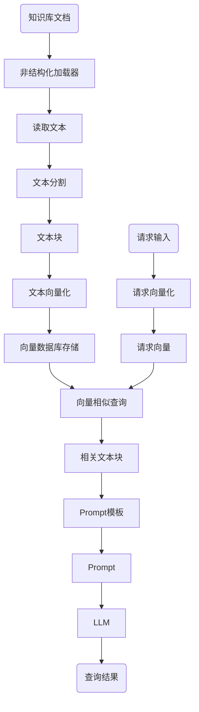


##### 2.2 问答流程

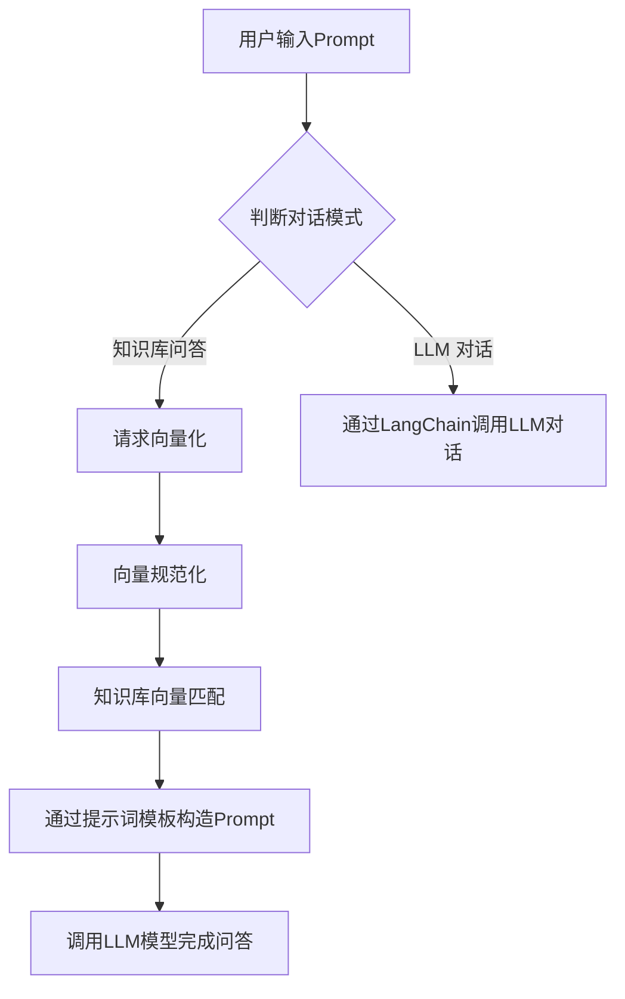


##### 2.3 系统架构


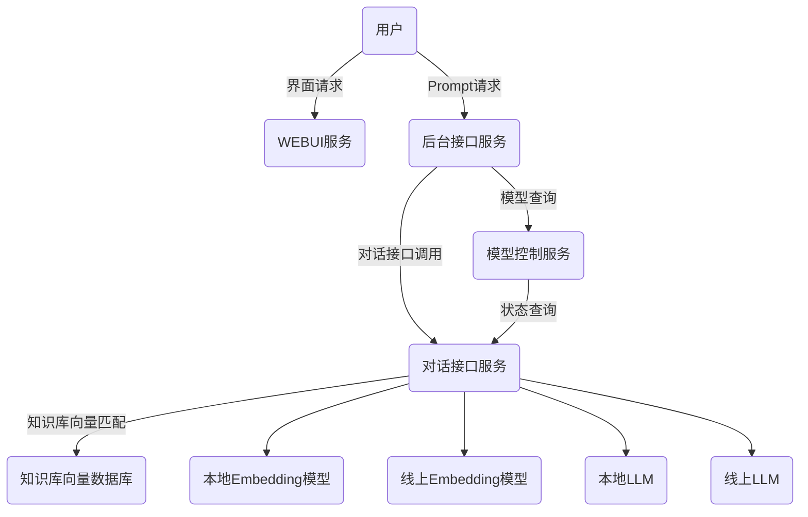


#### 3、系统安装部署

##### 3.1 环境配置

```shell
# 拉取仓库
git clone https://github.com/chatchat-space/Langchain-Chatchat.git

# 安装全部依赖
pip install -r requirements.txt 
pip install -r requirements_api.txt
pip install -r requirements_webui.txt  

#  默认依赖包括基本运行环境（FAISS向量库）

# 安装cuda
conda install pytorch torchvision torchaudio pytorch-cuda=11.8 -c pytorch -c nvidia -y

# 安装zhipuai(远程接口调用,Online LLM 接口)
pip install zhipuai
```


##### 3.2 模型下载

```shell
# linux 下先执行 （下载大的二进制文件）
yum install git-lfs
#windows 下先执行
git lfs install

# 下载LLM模型chatglm3-6b，因huggingface无法连接，从modelscope下载
git clone https://www.modelscope.cn/ZhipuAI/chatglm3-6b.git

# 下载LLM模型Qwen-1_8B-Chat，从modelscope下载
git clone https://www.modelscope.cn/qwen/Qwen-1_8B-Chat.git

# 下载Embedding模型BAAI/bge-large-zh，因huggingface无法连接，从modelscope下载
git clone https://www.modelscope.cn/AI-ModelScope/bge-large-zh.git
```


##### 3.3 初始化知识库和配置文件

```she
# 生成配置文件
python copy_config_example.py
# 初始化知识库
python init_database.py --recreate-vs

# 修改模型配置文件 configs/model_config.py
# 修改本地模型库路径
MODEL_ROOT_PATH = "H:/models"
# 因显存不够，修改模型为千问1.8b模型，此模型在4GB显存下勉强可以运行，而chatglm3-6b需要12GB以上显存
LLM_MODELS = ["Qwen-1_8B-Chat", "zhipu-api", "openai-api"]

# 配置线上模型 具体注册及api key获取前往 http://open.bigmodel.cn
    "zhipu-api": {
        "api_key": "xxxxxxxxxxxxxxxxxxxxxxxxxxxxxxxx.xxxxxxxxxxxxxxxx",
        "version": "chatglm_turbo",  # 可选包括 "chatglm_turbo"
        "provider": "ChatGLMWorker",
    }
```


##### 3.4 启动项目

```
python startup.py -a
```


#### 4、核心代码简介

##### 4.1 加载Embedding模型

```
def load_embeddings(self, model: str = None, device: str = None) -> Embeddings:
	......
    query_instruction = "为这个句子生成表示以用于检索相关文章："
    embeddings = HuggingFaceBgeEmbeddings(model_name=get_model_path(model),
                                                      model_kwargs={'device': device},
                                                      query_instruction=query_instruction)
    ......
                                                      
    return embeddings
```


##### 4.2 文本向量化

```code
def embed_texts(
    texts: List[str],
    embed_model: str = EMBEDDING_MODEL,
    to_query: bool = False,
) -> BaseResponse:
    '''
    对文本进行向量化。返回数据格式：BaseResponse(data=List[List[float]])
    '''
    try:
        if embed_model in list_embed_models(): # 使用本地Embeddings模型
            from server.utils import load_local_embeddings

            embeddings = load_local_embeddings(model=embed_model)
            return BaseResponse(data=embeddings.embed_documents(texts))

        if embed_model in list_online_embed_models(): # 使用在线API
            config = get_model_worker_config(embed_model)
            worker_class = config.get("worker_class")
            worker = worker_class()
            if worker_class.can_embedding():
                params = ApiEmbeddingsParams(texts=texts, to_query=to_query)
                resp = worker.do_embeddings(params)
                return BaseResponse(**resp)

        return BaseResponse(code=500, msg=f"指定的模型 {embed_model} 不支持 Embeddings 功能。")
    except Exception as e:
        logger.error(e)
        return BaseResponse(code=500, msg=f"文本向量化过程中出现错误：{e}")
```


##### 4.3 请求向量化规范化

```code
def embed_query(self, text: str) -> List[float]:
    '''
    对query内容进行向量化并规范化
    '''
    embeddings = embed_texts(texts=[text], embed_model=self.embed_model, to_query=True).data
    query_embed = embeddings[0]
    query_embed_2d = np.reshape(query_embed, (1, -1))  # 将一维数组转换为二维数组
    normalized_query_embed = normalize(query_embed_2d)
    return normalized_query_embed[0].tolist()  # 将结果转换为一维数组并返回
```


##### 4.4 知识库向量匹配

```
def do_search(self,
              query: str,
              top_k: int,
              score_threshold: float = SCORE_THRESHOLD,
              ) -> List[Document]:
    '''
    知识库向量匹配
    '''
    embed_func = EmbeddingsFunAdapter(self.embed_model)
    embeddings = embed_func.embed_query(query)
    with self.load_vector_store().acquire() as vs:
        docs = vs.similarity_search_with_score_by_vector(embeddings, k=top_k, score_threshold=score_threshold)
    return docs
```

```
def similarity_search_with_score_by_vector(
    self,
    embedding: List[float],
    k: int = 4,
    filter: Optional[Dict[str, Any]] = None,
    fetch_k: int = 20,
    **kwargs: Any,
) -> List[Tuple[Document, float]]:
    '''
	返回知识库中与请求最相似的向量文档
	相似度算法为L2 distance
	默认向量库/全文检索引擎类型使用faiss，faiss (Facebook AI Similarity Search) 是一个高效的相似性搜索和聚类库，由 Facebook AI 研究院开发。它在大规模高维向量空间中提供了快速的索引和检索功能。

    '''
    faiss = dependable_faiss_import()
    vector = np.array([embedding], dtype=np.float32)
    if self._normalize_L2:
        faiss.normalize_L2(vector)
    scores, indices = self.index.search(vector, k if filter is None else fetch_k)
    docs = []
    for j, i in enumerate(indices[0]):
        if i == -1:
            # This happens when not enough docs are returned.
            continue
        _id = self.index_to_docstore_id[i]
        doc = self.docstore.search(_id)
        if not isinstance(doc, Document):
            raise ValueError(f"Could not find document for id {_id}, got {doc}")
        if filter is not None:
            filter = {
                key: [value] if not isinstance(value, list) else value
                for key, value in filter.items()
            }
            if all(doc.metadata.get(key) in value for key, value in filter.items()):
                docs.append((doc, scores[0][j]))
        else:
            docs.append((doc, scores[0][j]))

    score_threshold = kwargs.get("score_threshold")
    if score_threshold is not None:
        cmp = (
            operator.ge
            if self.distance_strategy
            in (DistanceStrategy.MAX_INNER_PRODUCT, DistanceStrategy.JACCARD)
            else operator.le
        )
        docs = [
            (doc, similarity)
            for doc, similarity in docs
            if cmp(similarity, score_threshold)
        ]
    return docs[:k]
```


##### 4.5 加载LLM模型

```
# auto_factory.py
model_class = get_class_from_dynamic_module(
    class_ref, pretrained_model_name_or_path, code_revision=code_revision, **hub_kwargs, **kwargs
)
return model_class.from_pretrained(
    pretrained_model_name_or_path, *model_args, config=config, **hub_kwargs, **kwargs
)

# model_adapter.py
model = AutoModel.from_pretrained(
                model_path,
                low_cpu_mem_usage=True,
                trust_remote_code=True,
                **from_pretrained_kwargs,
            )

# model_worker.py
self.model, self.tokenizer = load_model(
            model_path,
            device=device,
            num_gpus=num_gpus,
            max_gpu_memory=max_gpu_memory,
            dtype=dtype,
            load_8bit=load_8bit,
            cpu_offloading=cpu_offloading,
            gptq_config=gptq_config,
            awq_config=awq_config,
            exllama_config=exllama_config,
            xft_config=xft_config,
            debug=debug,
        )
```


##### 4.6 调用模型获得回复内容

```
async def knowledge_base_chat(query: str = Body(..., description="用户输入", examples=["你好"]),
                              knowledge_base_name: str = Body(..., description="知识库名称", examples=["samples"]),
                              top_k: int = Body(VECTOR_SEARCH_TOP_K, description="匹配向量数"),
                              score_threshold: float = Body(
                                  SCORE_THRESHOLD,
                                  description="知识库匹配相关度阈值，取值范围在0-1之间，SCORE越小，相关度越高，取到1相当于不筛选，建议设置在0.5左右",
                                  ge=0,
                                  le=2
                              ),
                              history: List[History] = Body(
                                  [],
                                  description="历史对话",
                                  examples=[[
                                      {"role": "user",
                                       "content": "我们来玩成语接龙，我先来，生龙活虎"},
                                      {"role": "assistant",
                                       "content": "虎头虎脑"}]]
                              ),
                              stream: bool = Body(False, description="流式输出"),
                              model_name: str = Body(LLM_MODELS[0], description="LLM 模型名称。"),
                              temperature: float = Body(TEMPERATURE, description="LLM 采样温度", ge=0.0, le=1.0),
                              max_tokens: Optional[int] = Body(
                                  None,
                                  description="限制LLM生成Token数量，默认None代表模型最大值"
                              ),
                              prompt_name: str = Body(
                                  "default",
                                  description="使用的prompt模板名称(在configs/prompt_config.py中配置)"
                              ),
                              request: Request = None,
                              ):
    kb = KBServiceFactory.get_service_by_name(knowledge_base_name)
    if kb is None:
        return BaseResponse(code=404, msg=f"未找到知识库 {knowledge_base_name}")

    history = [History.from_data(h) for h in history]

    async def knowledge_base_chat_iterator(
            query: str,
            top_k: int,
            history: Optional[List[History]],
            model_name: str = LLM_MODELS[0],
            prompt_name: str = prompt_name,
    ) -> AsyncIterable[str]:
        nonlocal max_tokens
        callback = AsyncIteratorCallbackHandler()
        if isinstance(max_tokens, int) and max_tokens <= 0:
            max_tokens = None

        model = get_ChatOpenAI(
            model_name=model_name,
            temperature=temperature,
            max_tokens=max_tokens,
            callbacks=[callback],
        )
        docs = search_docs(query, knowledge_base_name, top_k, score_threshold)
        context = "\n".join([doc.page_content for doc in docs])
        if len(docs) == 0:  # 如果没有找到相关文档，使用empty模板
            prompt_template = get_prompt_template("knowledge_base_chat", "empty")
        else:
            prompt_template = get_prompt_template("knowledge_base_chat", prompt_name)
        input_msg = History(role="user", content=prompt_template).to_msg_template(False)
        chat_prompt = ChatPromptTemplate.from_messages(
            [i.to_msg_template() for i in history] + [input_msg])

        chain = LLMChain(prompt=chat_prompt, llm=model)

        # Begin a task that runs in the background.
        task = asyncio.create_task(wrap_done(
            chain.acall({"context": context, "question": query}),
            callback.done),
        )

        source_documents = []
        for inum, doc in enumerate(docs):
            filename = doc.metadata.get("source")
            parameters = urlencode({"knowledge_base_name": knowledge_base_name, "file_name": filename})
            base_url = request.base_url
            url = f"{base_url}knowledge_base/download_doc?" + parameters
            text = f"""出处 [{inum + 1}] [{filename}]({url}) \n\n{doc.page_content}\n\n"""
            source_documents.append(text)

        if len(source_documents) == 0:  # 没有找到相关文档
            source_documents.append(f"<span style='color:red'>未找到相关文档,该回答为大模型自身能力解答！</span>")

        if stream:
            async for token in callback.aiter():
                # Use server-sent-events to stream the response
                yield json.dumps({"answer": token}, ensure_ascii=False)
            yield json.dumps({"docs": source_documents}, ensure_ascii=False)
        else:
            answer = ""
            async for token in callback.aiter():
                answer += token
            yield json.dumps({"answer": answer,
                              "docs": source_documents},
                             ensure_ascii=False)
        await task

    return StreamingResponse(knowledge_base_chat_iterator(query=query,
                                                          top_k=top_k,
                                                          history=history,
                                                          model_name=model_name,
                                                          prompt_name=prompt_name),
                             media_type="text/event-stream")
```


##### 4.7 构造FastAPI app

```
def create_app(run_mode: str = None):
    app = FastAPI(
        title="Langchain-Chatchat API Server",
        version=VERSION
    )
    MakeFastAPIOffline(app)
    # Add CORS middleware to allow all origins
    # 在config.py中设置OPEN_DOMAIN=True，允许跨域
    # set OPEN_DOMAIN=True in config.py to allow cross-domain
    if OPEN_CROSS_DOMAIN:
        app.add_middleware(
            CORSMiddleware,
            allow_origins=["*"],
            allow_credentials=True,
            allow_methods=["*"],
            allow_headers=["*"],
        )
    mount_app_routes(app, run_mode=run_mode)
    return app
```


##### 4.8 添加路由

```
def mount_app_routes(app: FastAPI, run_mode: str = None):
    app.get("/",
            response_model=BaseResponse,
            summary="swagger 文档")(document)

    app.post("/chat/knowledge_base_chat",
             tags=["Chat"],
             summary="与知识库对话")(knowledge_base_chat)

    app.post("/chat/chat",
             tags=["Chat"],
             summary="与llm模型对话(通过LLMChain)",
             )(chat)
```


##### 4.9 启动`API`服务

```
def run_api_server(started_event: mp.Event = None, run_mode: str = None):
    from server.api import create_app
    import uvicorn
    from server.utils import set_httpx_config
    set_httpx_config()

    app = create_app(run_mode=run_mode)
    _set_app_event(app, started_event)

    host = API_SERVER["host"]
    port = API_SERVER["port"]

    uvicorn.run(app, host=host, port=port)
```


#### 5、效果评测

​		在本次项目中，我们对此基于大模型的企业级知识库问答系统的效果进行了评估。为了保护用户隐私和数据安全，我们从中国移动官方网站（https://rcs.10086.cn/faq.html）下载了脱敏后的文件作为测试数据集。

​		由于本地测试机器的内存和`GPU`限制，我们选择了`Qwen-1_8B-Chat`模型进行本地测试。这个选择主要是考虑到该模型的资源需求与我们的硬件条件相匹配。

​		同时，我们也使用线上模型zhipu-api进行对比测试。通过对比两个模型在相同测试数据上的表现，我们可以更好地理解它们各自的优缺点，并为后续优化提供依据。

​		在此次评测中，我们选择了两个问题作为评测结果的效果展示。初步评测结果具体如下：

##### 问题1：通话过程中，可以收发`5g`消息吗？

###### LLM对话（不使用知识库）

<div>
    <center>
    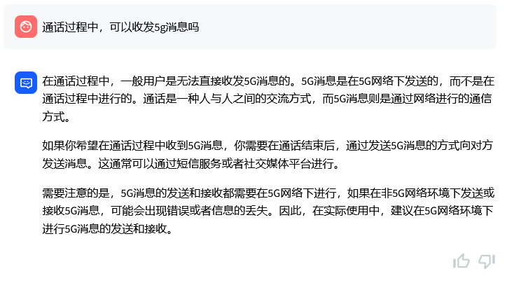
    <br>
    Qwen-1_8B-Chat模型
    </center>
</div>
<div>
    <center>
    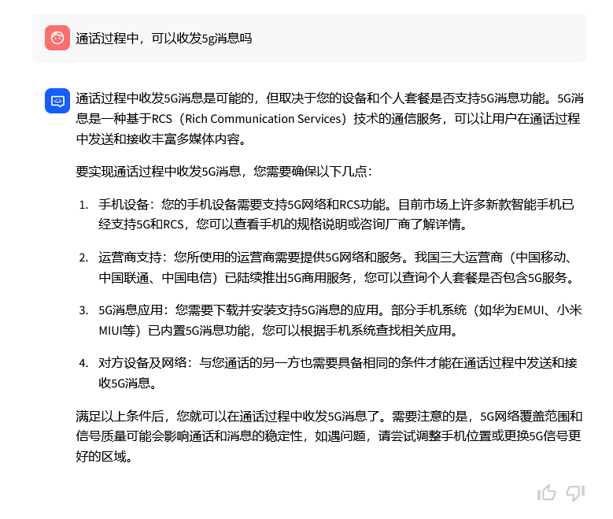
    <br>
    zhipu-api模型
    </center>
</div>

可见由于训练数据集和模型参数的限制， `Qwen-1_8B-Chat`模型的回答不是很正确，而zhipu-api模型的回答基本上是正确的。

###### 知识库问答（使用知识库）

<div>
    <center>
    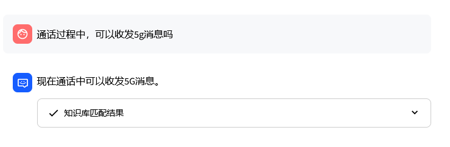
    <br>
    Qwen-1_8B-Chat模型
    </center>
</div>
<div>
    <center>
    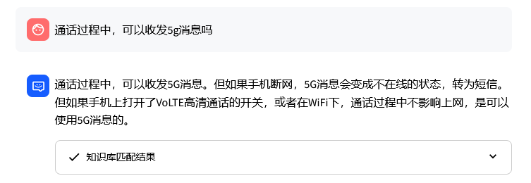
    <br>
    zhipu-api模型
    </center>
</div>

通过对比可以发现，`Qwen-1_8B-Chat`模型从知识库中找到了答案，但是对上下文的理解和语言的组织能力比较弱，只是简单的回答了问题。相对而言，zhipu-api模型的回答比较接近知识库的内容，基本上理解的知识库相关内容的语义。

知识库的原文如下：

```code
通话过程中，能否进行 5G 消息的收发？
手机通话过程中，手机断网，5G 消息变成不在线的状态，会转为短信。但如果手机上打开了 volte 高清通话的开关，或者在 Wifi下，通话过程中不影响上网，是可以使用 5G 消息的。
```


##### 问题2： `5g`消息的取消方式有哪些

###### LLM对话（不使用知识库）

<div>
    <center>
    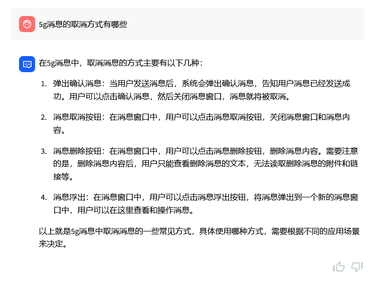
    <br>
    Qwen-1_8B-Chat模型
    </center>
</div>
<div>
    <center>
    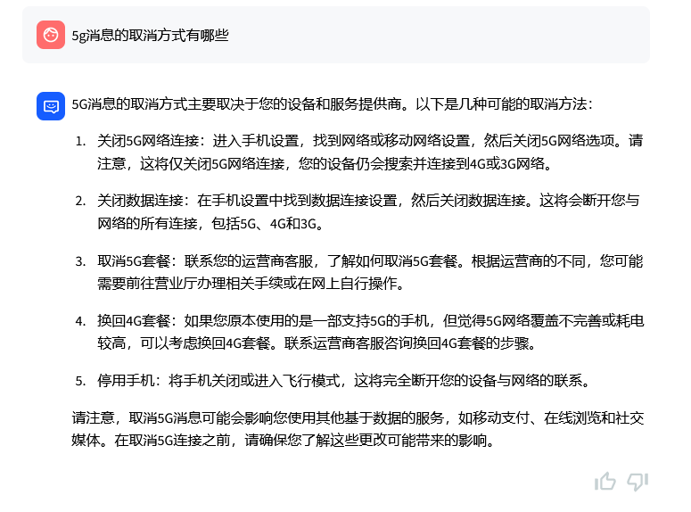
    <br>
    zhipu-api模型
    </center>
</div>

在这个问题中，`Qwen-1_8B-Chat`模型的回答比较混乱，可能它的训练的知识库中不包含相关的内容，在答案中加入了自己编造的内容。zhipu-api模型的回答大体正确，其训练数据库中应该包含了这部分的内容。

###### 知识库问答（使用知识库）

<div>
    <center>
    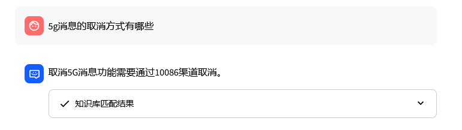
    <br>
    Qwen-1_8B-Chat模型
    </center>
</div>
<div>
    <center>
    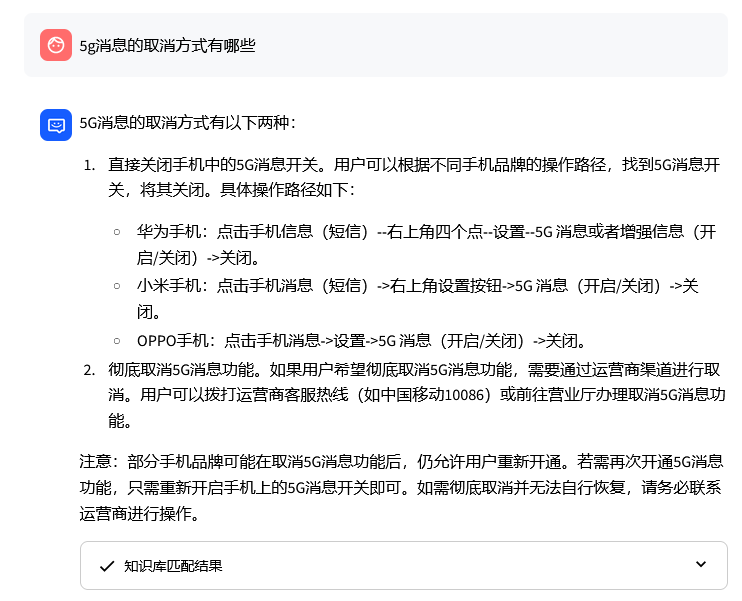
    <br>
    zhipu-api模型
    </center>
</div>


同样通过对比可以发现，`Qwen-1_8B-Chat`模型从知识库中找到了答案，但是对上下文的理解和语言的组织能力比较弱，只是简单的回答了问题。相对而言，zhipu-api模型的回答比较接近知识库的内容，基本上理解的知识库相关内容的语义。

知识库的原文如下：

```code
取消方式 
如果用户只是不想使用5G消息，可直接关闭手机中的5G消息开关即可。
如果用户希望彻底取消5G消息功能，则需要通过10086渠道取消5G消息功能
```


综上可以看出：

​		(1)、此系统比较完整有效的实现了预期功能，即通过本地文档的录入，构建企业级的知识库系统，结合大模型的语言能力，基本有效的实现了基于大模型的企业级知识库问答系统。通过向量数据库的相似查询和大模型的prompt优化，系统可以完整且基本正确的输出知识库的内容完成问答。

​		(2)、从`Qwen-1_8B-Chat`模型和`zhipu-api`模型的回答对比可以看出，由于模型训练集的不同和参数量的不同，两个模型的理解和推理能力有较大差别,`zhipu-api`模型明显优于`Qwen-1_8B-Chat`模型。`Qwen-1_8B-Chat`模型参数量只有18亿,而`zhipu-api`使用的是`chatglm_turbo`模型,我没有查到该模型的参数量，但该模型的效果接近`GPT-3.5`,而`GPT-3.5`的参数量是1750亿，可以简单认为两者参数量相近，这样的话是`Qwen-1_8B-Chat`模型参数量的近百倍。

​		(3)、因此，系统优化的两个主要方向，一是采用更好的Embedding模型及更合适的向量数据库，二是采用更加智能的通用大模型。

#### 6、项目总结

​		本项目基于开源框架`Langchain-Chatchat`完成了一个基于大模型的企业级知识库问答系统的开发应用展示，基本实现了预期的功能；

​		初步的系统性学习了文本挖掘方法，大模型系统架构及原理；

​		初步掌握了基于`huggingface`自然语言处理的基本工具和方法及应用 ；

​		初步掌握了向量数据库部署、构建、查询及应用的方法 ；

​        基本掌握了在线和离线大模型的部署、使用方法,并掌握了一定的技巧；

​		加深了对自然语言处理及大模型以至人工智能的理解和兴趣，确立的今后工作和研究的新的方向。

#### 7、下一步工作

​		在本项目中，我们已经基于开源框架`Langchain-Chatchat`进行了开发实践。下一步我们将致力于完善系统功能和优化性能，以满足企业内部的产品化使用需求。

​		首先，我们将继续探索高性能、效果好的模型组合，旨在降低系统的资源需求并提高产品的整体性能。这将包括对现有模型的评估和选择，以及可能的新模型训练。

​		其次，我们将研究如何利用企业知识库来微调`LLM`（大规模语言模型），从而更好地适应特定的企业应用场景，并提升系统的回答质量和准确性。

​		此外，我们将探索更适合产品化的向量数据库技术，以便更高效地存储和检索相关信息，进一步增强系统的响应能力和用户体验。

​		通过`Finetuning`（微调）技术，我们将优化大模型的效果，使其更加贴合我们的具体应用需求。同时，我们计划采用Agent工具扩展系统的功能，使系统不仅能“说”，还能执行各种任务，从而提供更全面的服务。

​		总之，我们的目标是尽快完成项目的 `productization`，并在此过程中不断挖掘和实现`LLM`的能力。这不仅会提升我们的产品竞争力，也将有助于我们在实际应用中积累宝贵的经验和技术洞察。

#### 8、致谢

​		首先，衷心感谢我们的老师以高屋建瓴的讲解方式，引领我们步入了一个全新的知识领域。老师的教导不仅使我们了解了这个领域的基础知识，更启发了我们的思考和探索。

​		其次，我要向我的同学们表示深深的感谢。你们的热情分享拓宽了我的视野，让我学习到了许多新的方法和技巧。通过与你们的交流和合作，我找到了前进的方向和动力。

​		此外，我要特别感谢`GitHub`、`Hugging Face`、`ModelScope`等平台，以及`Langchain`和`Langchain-Chatchat`等开源框架。这些资源为我们的项目提供了极大的帮助，使我们能够更容易、更深入地了解大模型及其应用。致敬所有的知名的和默默无闻的开源贡献者！

​		最后，我要感谢所有在这个过程中给予我帮助和支持的人，要感谢这个百花齐放的大模型时代。在这个时代中，我们可以尽情探索、尝试和创新，实现自己的梦想。我会珍惜这次经历，珍惜这个机会，继续努力学习，不断提高自己。