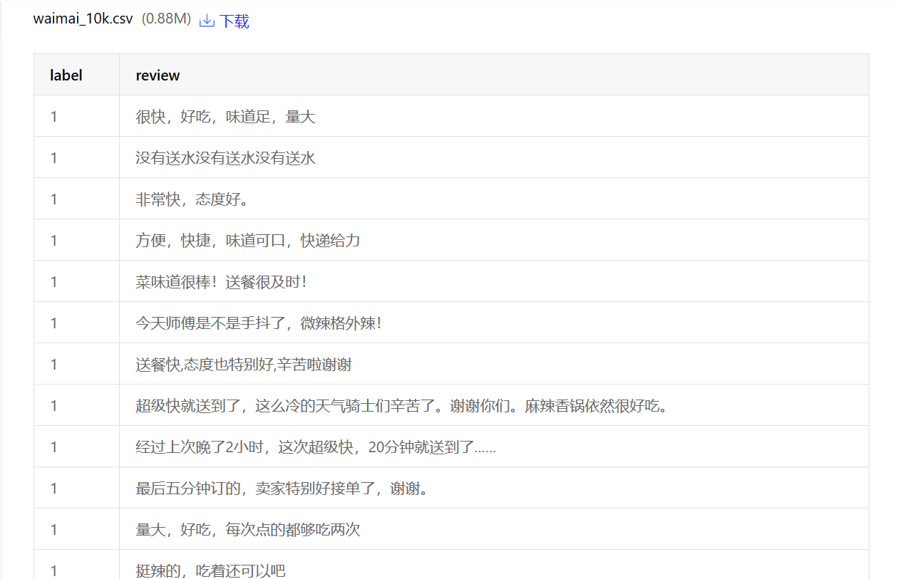
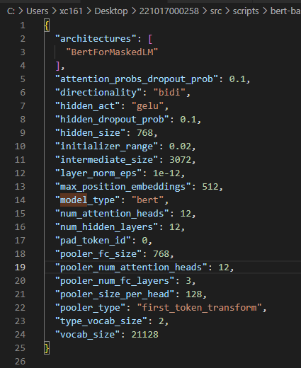
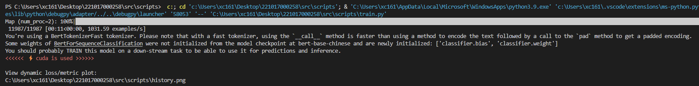
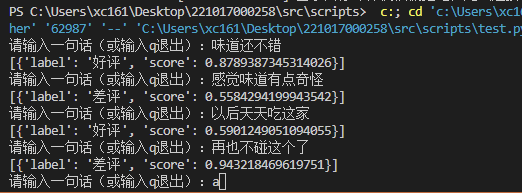

# 基于Bert模型实现的外卖评论好评差评的分类

## 项目目标
利用Bert模型实现外卖评论分类，通过对评论进行情感分析和分类，准确识别文本表达的是好评还是差评，帮助餐厅和外卖平台更好地理解客户需求和消费者满意度，从而优化产品和服务，提升客户体验。

### 具体目标包括：

构建一个基于Bert模型的外卖评论分类系统，能够对评论进行情感分析，实现好评和差评分类；
通过对大量外卖评论数据进行预处理，包括数据清洗、文本预处理等，提高模型的训练效果；
通过对模型参数的调优，提高模型的准确率和召回率，实现对评论的准确分类；
实现为外卖平台和餐厅提供一种有效的评论分类方法，帮助他们更好地了解客户需求和满意度，提升客户体验。

## 项目实现
BERT模型是一种基于Transformer构建的双向语义编码表征模型，全称为Bidirectional Encoder Representations from Transformers。它通过在大规模的无标注语料上进行预训练学习，得到的模型可以应用于多个类型的下游任务。

BERT模型有两个重要的特点：

它是深度双向表征模型，体现在它表征每一个词语时都同时利用了全部上下文信息。
它通过两个任务进行预训练，第一个是采用 MaskLM 的方式来训练语言模型，第二个是在双向语言模型的基础上额外增加了一个句子级别的连续性预测任务。
BERT模型的实现分为两个步骤：第一，在大规模语料上进行预训练（pre-training）；第二，在具体下游任务上利用该任务的数据集进行微调训练（fine-tuning）。此外，BERT的预训练是一个很耗费资源的过程，一般没有必要自己从头训练，可以加载官方已经训练好的模型，然后在自己的具体任务上直接进行微调训练。

采用BERT-Chinese的预训练模型，用外卖平台的评论数据集进行训练，数据集包含外卖评论的文本和对应标签，由1表示好评，0表示差评。
数据集地址：https://aistudio.baidu.com/datasetdetail/231200/0


### Bert参数


包含模型及权重的完整文件，网盘下载地址：链接: https://caiyun.139.com/m/i?005CibJDJBm01  提取码:S0QY  复制内容打开中国移动云盘手机APP，操作更方便哦
### 具体项目实现代码：

```python
import pandas as pd
import torch
from torch.utils.data import DataLoader
import datasets
from transformers import AutoTokenizer
from transformers import AutoModelForSequenceClassification
from torchkeras import KerasModel
import evaluate

df = pd.read_csv("../dataset/waimai_10k.csv")
ds = datasets.Dataset.from_pandas(df)
ds = ds.shuffle(42) #打乱顺序
ds = ds.rename_columns({"review":"text","label":"labels"})

tokenizer = AutoTokenizer.from_pretrained('bert-base-chinese') #需要和模型一致
if __name__ == '__main__':
    ds_encoded = ds.map(lambda example:tokenizer(example["text"],
                      max_length=50,truncation=True,padding='max_length'),
                      batched=True,
                      batch_size=20,
                      num_proc=2) #支持批处理和多进程map
    # 转换成pytorch中的tensor
    ds_encoded.set_format(type="torch", columns=["input_ids", 'attention_mask', 'token_type_ids', 'labels'])
    # 分割成训练集和测试集
    ds_train_val, ds_test = ds_encoded.train_test_split(test_size=0.2).values()
    ds_train, ds_val = ds_train_val.train_test_split(test_size=0.2).values()
    # 在collate_fn中可以做动态批处理(dynamic batching)
    def collate_fn(examples):
        return tokenizer.pad(examples)
    dl_train = torch.utils.data.DataLoader(ds_train, batch_size=16, collate_fn=collate_fn)
    dl_val = torch.utils.data.DataLoader(ds_val, batch_size=16, collate_fn=collate_fn)
    dl_test = torch.utils.data.DataLoader(ds_test, batch_size=16, collate_fn=collate_fn)
    for batch in dl_train:
        break
        # 加载模型 (会添加针对特定任务类型的Head)
    model = AutoModelForSequenceClassification.from_pretrained('bert-base-chinese', num_labels=2)
    dict(model.named_children()).keys()
    output = model(**batch)
    class StepRunner:
        def __init__(self, net, loss_fn, accelerator, stage="train", metrics_dict=None,
                     optimizer=None, lr_scheduler=None
                     ):
            self.net, self.loss_fn, self.metrics_dict, self.stage = net, loss_fn, metrics_dict, stage
            self.optimizer, self.lr_scheduler = optimizer, lr_scheduler
            self.accelerator = accelerator
            if self.stage == 'train':
                self.net.train()
            else:
                self.net.eval()
        def __call__(self, batch):
            out = self.net(**batch)
            # loss
            loss = out.loss
            # preds
            preds = (out.logits).argmax(axis=1)
            # backward()
            if self.optimizer is not None and self.stage == "train":
                self.accelerator.backward(loss)
                self.optimizer.step()
                if self.lr_scheduler is not None:
                    self.lr_scheduler.step()
                self.optimizer.zero_grad()
            all_loss = self.accelerator.gather(loss).sum()
            labels = batch['labels']
            acc = (preds == labels).sum() / ((labels > -1).sum())
            all_acc = self.accelerator.gather(acc).mean()
            # losses
            step_losses = {self.stage + "_loss": all_loss.item(), self.stage + '_acc': all_acc.item()}
            # metrics
            step_metrics = {}
            if self.stage == "train":
                if self.optimizer is not None:
                    step_metrics['lr'] = self.optimizer.state_dict()['param_groups'][0]['lr']
                else:
                    step_metrics['lr'] = 0.0
            return step_losses, step_metrics
    KerasModel.StepRunner = StepRunner
    optimizer = torch.optim.AdamW(model.parameters(), lr=3e-5)
    keras_model = KerasModel(model,
                             loss_fn=None,
                             optimizer=optimizer
                             )

    keras_model.fit(
        train_data=dl_train,
        val_data=dl_val,
        ckpt_path='bert_waimai.pt',
        epochs=100,
        patience=10,
        monitor="val_acc",
        mode="max",
        plot=True,
        wandb=False,
        quiet=True
    )
    model.eval()
    model.config.id2label = {0: "差评", 1: "好评"}
    model.save_pretrained("waimai_10k_bert")
    tokenizer.save_pretrained("waimai_10k_bert")
```


### 模型训练结束



## 训练结果


### 测试程序代码
```Python
from transformers import pipeline
classifier = pipeline("text-classification", model="waimai_10k_bert")
while True:
    text = input("请输入一句话（或输入quit退出）：")
    if text == "quit":
        break
    result = classifier(text)
    print(result)
```
## 测试结果
