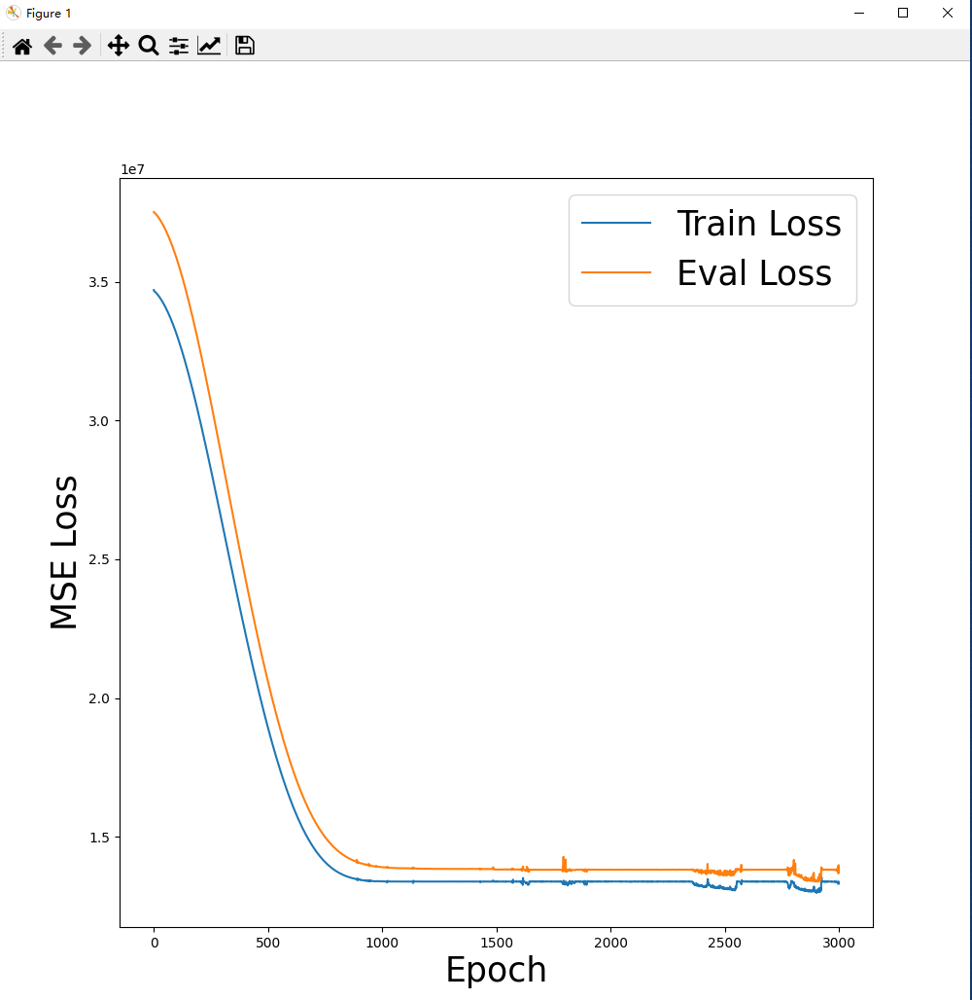
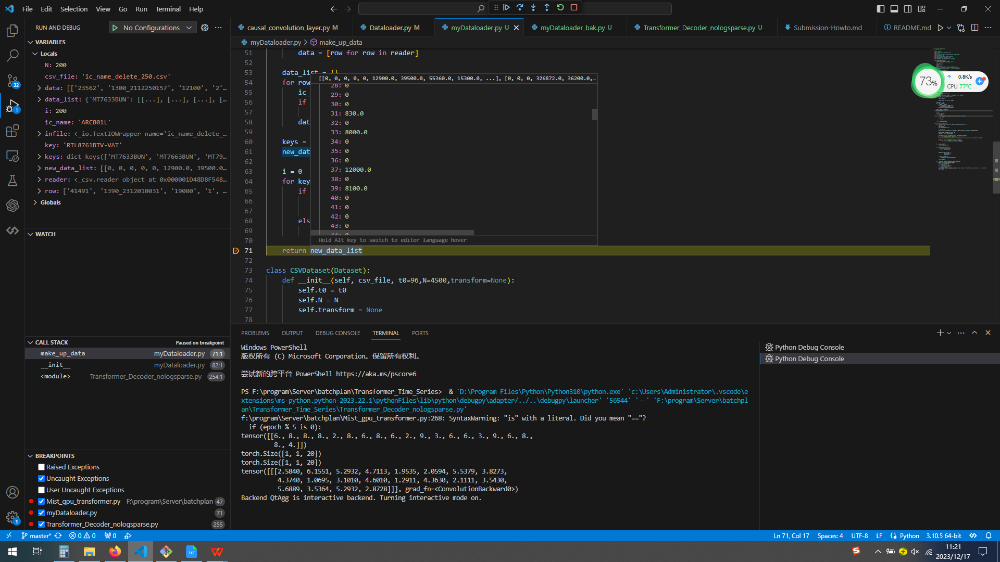
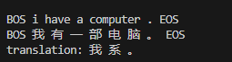
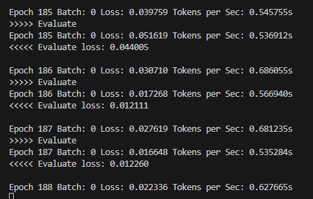
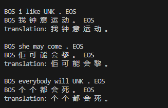

# 基于Transformer的翻译模型（英-＞粤语）

1. 一开始选的题目是使用 Transformer 的时间序列对生产订单的预测。
   
   第一次训练的结果如下，偏差太大了
   

   后来查看数据，发现数据上有很多订单数据是ckd订单或者是流水号订单
   
   将这些数据整理后，还是发现不收敛。

   然后查看资料，了解transformer的原理。
   了解原理后，仔细查看源代码，发现其数据是根据多客户多时间来预测的。

   所以重新将数据整理成按照ic和订单来分类生成训练数据集，
   见附件：ic_name.csv，由于保密的原因，隐去了ic类型以及其他的一些数据
   同时删除了一些数据

   训练后，数据还是不收敛，然后查看数据后，发现我们的订单数据太零散了很多地方为0,
   有时候隔几个月才有新生产，估计这个原因，造成无法预测，如果要对其预测
   还是需要从其他维度进行分析。

   

2. 由于时间原因，因为Transformer很多用于翻译，所以最后改成了用Transformer 进行英-》粤语的翻译
   
3. 准备训练文档
   tran_mini.txt

4. 准备测试文档
   test_mini.txt

5. 网上下载demo代码
   
6. 因为网上翻译的语库是繁体，同事有一些单词是异体字，所以需要整理一下
   
   例如： 嘅 就是不常见的一体字，这里将其改成 ‘的’

7. 对数据预处理
   
   因为输入的预料，长度不一，所以需要pad

   同时需要将每句话按字粒度切分开，并构建词表，然后将单词映射为索引，并按照数据长度划分批次

8. 执行代码
   
   进行训练，从训练结果看，数据是有收敛的，可能由于训练次数有限，没有完全收敛

   

9.  测试验证
   
   验证的结果，几乎只能翻译第一个词

   

10. 增加训练次数，其损失会减少，翻译结果也正确很多
    
    

11. 经验总结，对于各种模型，网络上有很多例子，但是用于实际使用的时候，还是需要对初始的数据集进行处理、分析，微调，根据具体的数据集，找出其特征，才能适应实际情况。但是听说chatgpt之类的大模型，可以直接上传原始数据，其自动对其分析，这个找机会验证一下。同时，发现对各种模型了解还是不透彻，无法深入微调，并且对矩阵的知识要求很高，需要深入学习矩阵的相关知识。   
