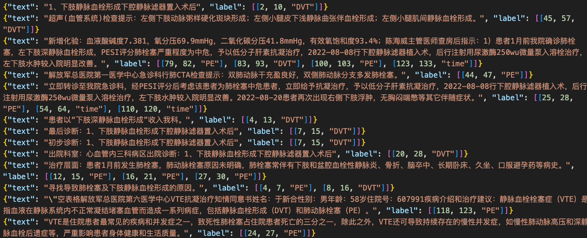
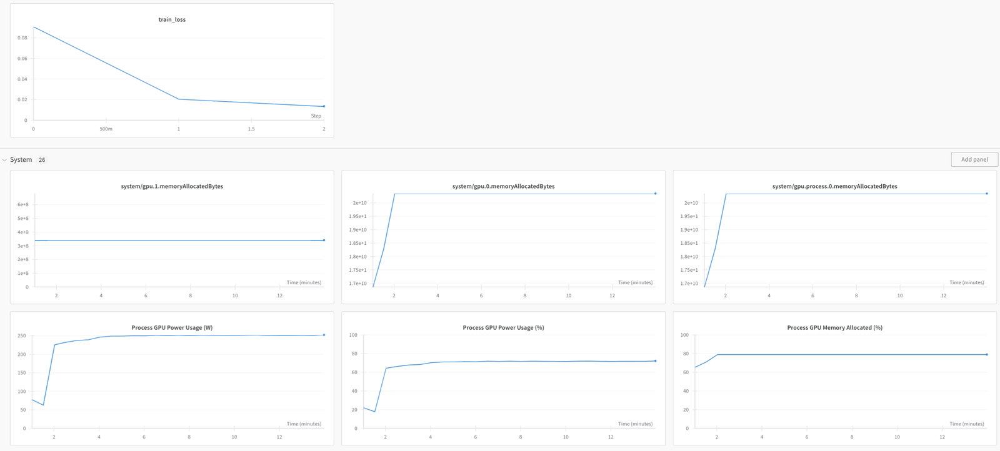

- 业务目标：从电子病历识别患者是否患有DVT或PE以及对应的时间，本质为NER识别
  - DVT的样例：双下肢深静脉血栓、左侧小腿多条肌间静脉血栓、右侧小腿肌间静脉血栓、右侧髂静脉血栓形成
  - PE的样例：肺栓塞、肺动脉栓塞、慢性血栓栓塞性肺动脉高压
  - 时间的样例：2022-09-02、1年多前、2020年、2022年1月3日
- 处理流程：
  - 准备数据集
    - 提取原始电子病历文档，进行句子拆分
    - 通过正则表达式进行初步识别，简化人工标注工作量
    - 机器标注结果上传到文本标注平台(Doccano平台)
    - 人工审核与标注
    - 导出标注结果，转换为模型输入格式
  - 模型定义：使用开源框架DeepKE
  - 模型训练与调参
  - 测试
- 数据集和NLP标注：
  标注样例如图所示：
  

  标注数据集导出如图所示：
  

```
动 O
脉 O
多 O
发 O
斑 O
块 O
伴 O
股 O
浅 O
动 O
脉 O
多 O
节 O
段 O
狭 O
窄 O
左 B-DVT
侧 I-DVT
小 I-DVT
腿 I-DVT
肌 I-DVT
间 I-DVT
静 I-DVT
脉 I-DVT
血 I-DVT
栓 I-DVT
形 I-DVT
成 I-DVT
```
- 数据集情况说明：
  -  总句子数：18942个句子，其中
     - "DVT"类型标注7701个实体
     - "PE"类型标注3747个实体
     - "TIME"类型标注7444个实体
  - 训练集：1399985 字符
  - 测试集：53838字符     
  - 验证集:  154010   字符
- 模型描述：
  - 基于开源DeepKE框架，进行NER识别
  - 基于bert的模型关键参数(conf/hydra/model/bert.yaml)
     - bert_model: "bert-base-chinese"
     - do_lower_case: True
     - fp16: False
     - fp16_opt_level: "01"
     - local_rank: -1
     - loss_scale: 0.0
     - max_grad_norm: 1.0
     - max_seq_length: 256 # `初始默认为128`
- 模型训练：
  - (deepke) root@ubuntu:/home/deploy/vte-nlp-ner/DeepKE-2.1.0/example/ner/standard# python  run_bert.py
    - 说明：若服务器网络不好的话，运行bert需要先从huggingface下载bert-base-chinese模型到本地，在配置文件中对应的bert_model: "bert-base-chinese"改为本地保存模型的目录
  - 训练过程可以通过wandb进行监控：
    

- 模型运行结果(bert)
```
              precision    recall  f1-score   support

         DVT     0.9091    0.9390    0.9238       426
          PE     0.9074    0.9378    0.9224       209
        TIME     0.9962    0.9962    0.9962       263

   micro avg     0.9336    0.9555    0.9444       898
   macro avg     0.9376    0.9577    0.9474       898
weighted avg     0.9342    0.9555    0.9447       898
```


