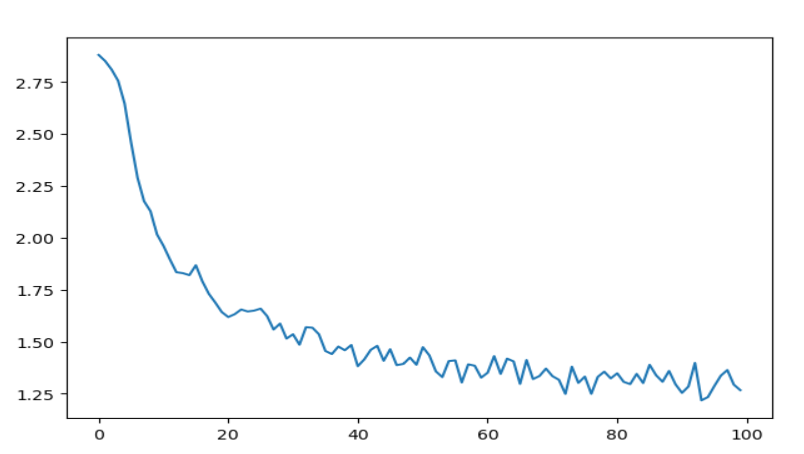
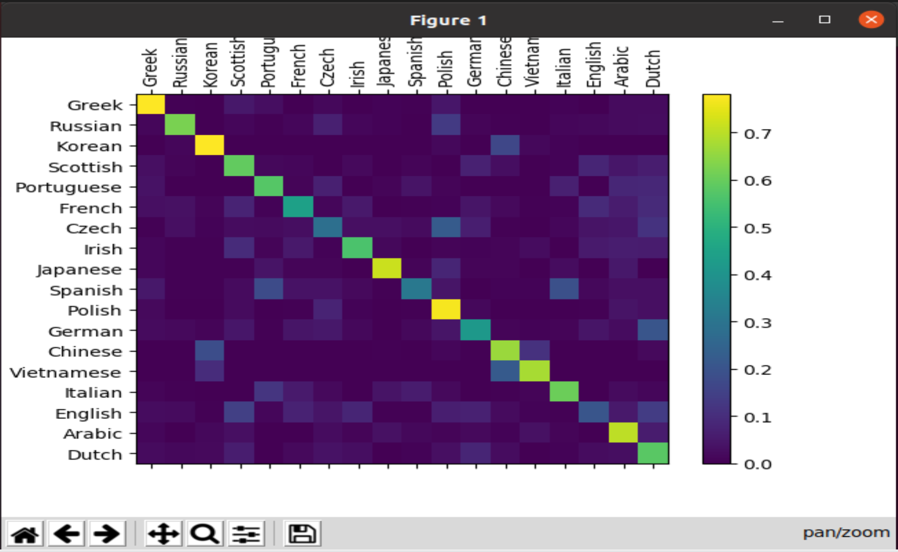
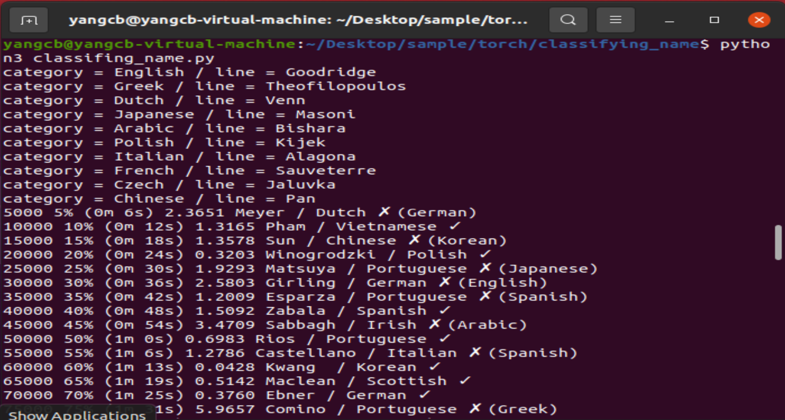

### 
使用字符级RNN对名字进行分类

---

#### 团队
   * 杨存彪 231017000020

---
#### 项目背景目标
  训练来自 18 种语言 的数千个姓氏，并根据 拼写预测名称来自哪种语言
- - - 
####  DataBase
    data/names/*.txt
data/names 目录中包含 18 个名为 [Language].txt 的文本文件。每个文件包含一堆名称，每行一个名称

---

#### 模型
定义一个简单的RNN模型，总共三层，两个线性变换层i2h, h2o，一个激活函数层softmax
* i2h(输入到隐藏层的线性变换层)
* h2o(隐藏层到输出的线性变换层)
* softmax(激活函数层，用于输出分类的概率分布)

---
#### 训练
 训练这个网络所需要做的就是向它展示一堆示例， 让它做出猜测，并告诉它是否错误。
 
 每个训练循环将：
  * 创建输入和目标张量
  * 创建归零的初始隐藏状态
  * 读取 and 中的每个字母
    * 保留下一个字母的隐藏状态
    * 将最终输出与目标进行比较
    * 反向传播
    * 返回输出和损失

由于 train 函数返回输出和损失，我们打印其猜测，并跟踪损失以进行绘图。由于有 1000 个 示例，我们仅打印每个 print_every 个示例，并取损失的平均值。
 
 

---
#### 评估结果
为了查看模型在不同类别上的表现，我们将创建一个矩阵，指示每种实际语言（行）网络猜测哪种语言（列）的效果

---
#### 模型结果
显示训练中的一些示例和最后的训练结果,输入名字，根据打分输出可能性最高的前三种语言

