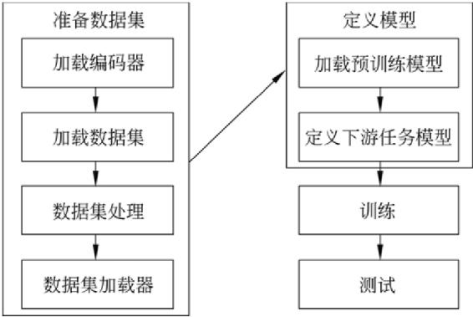
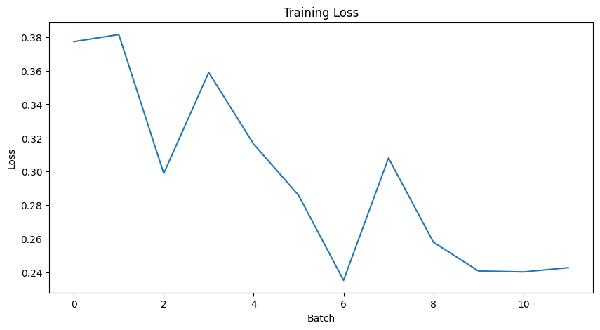

# 基于hfl/rbt3模型的情感分析学习研究——文本挖掘

<center><div style='height:2mm;'></div><div style="font-family:华文楷体;font-size:14pt;">黄玉立，231017000026</div></center>
<center><span style="font-family:华文楷体;font-size:9pt;line-height:9mm">信息学院 大数据科学与工程 </span>
</center>
<div>
<div style="width:52px;float:left; font-family:方正公文黑体;">摘　要：</div> 
<div style="overflow:hidden; font-family:华文楷体;">文本挖掘是一个从大量文本提取有意义的信息的领域，它通常涵盖用于挖掘和分析文本数据的技术。使用者通过它发现或提取有用的知识，并制定决策。文本挖掘可应用于任何自然语言的任意文本数据的统计方法，无需人工干预。本次作业主要实践NLP的具体流程，从准备数据集、定义模型、训练模型和测试模型四个方面入手熟悉开发流程。</div>
</div>
<div>
<div style="width:52px;float:left; font-family:方正公文黑体;">关键词：</div> 
<div style="overflow:hidden; font-family:华文楷体;">文本挖掘；NLP；模型；</div>
</div>


# Sentiment Analysis Study Based on the hfl/rbt3 Model - Text Mining Assignment

<center><div style='height:2mm;'></div><div style="font-size:14pt;">Yuli Huang</div></center>
<center><span style="font-size:9pt;line-height:9mm"><i>School of Information, Big Data Science and Engineering</i></span>
</center>
<div>
<div style="width:82px;float:left;line-height:16pt"><b>Abstract: </b></div> 
<div style="overflow:hidden;line-height:16pt">Text mining is a field that extracts meaningful information from a large amount of text. It usually covers techniques for mining and analyzing text data. Users discover or extract useful knowledge through it and make decisions. Text mining can apply statistical methods to any text data in any natural language without human intervention. This assignment mainly practices the specific process of NLP, familiarizing with the standard development process from four aspects: preparing the dataset, defining the model, training the model, and testing the model.</div>
</div>
<div>
<div style="width:82px;float:left;line-height:16pt"><b>Key Words: </b></div> 
<div style="overflow:hidden;line-height:16pt">Text Mining; NLP; Model; </div>
</div>


## 什么是文本挖掘

　　文本挖掘（Text mining）有时也被称为文字探勘、文本数据挖掘等，大致相当于文字分析，一般指文本处理过程中产生高质量的信息。高质量的信息通常通过分类和预测来产生，如模式识别。文本挖掘通常涉及输入文本的处理过程（通常进行分析，同时加上一些派生语言特征以及消除杂音，随后插入到数据库中） ，产生结构化数据，并最终评价和解释输出。典型的文本挖掘方法包括文本分类，文本聚类，概念/实体挖掘，生产精确分类，观点分析，文档摘要和实体关系模型 。^[1]^

## 自然语言处理的基本流程

### 准备数据集

　　数据集是进行NLP研究的基础，包含了大量文本数据和标注信息。数据集的质量和多样性对NLP的模型性能有着重要影响。本次作业主要是对预训练的语言模型进行微调，准备训练数据集是为了让模型能够学习到文本数据的特征和规律以更好的理解和处理自然语言。

　　<table style="border:none;text-align:center;width:auto;margin: 0 auto;">
	<tbody>
		<tr>
			<td style="padding: 6px"></td>
		</tr>
        <tr><td><strong>图 1 基本开发流程</strong></td></tr>
	</tbody>
</table>


#### 编码器

​		本次作业选择的模型是 hfl/rbt3，所以使用匹配的 rbt3编码工具。

​		编码器主要作用是将语料库中的文本数据转化为计算机可读的编码格式。编码器可对文本数据进行清洗、预处理、分词、标注等操作，提取文本中关键信息。

#### 数据集

​		数据集经过不断试错，从 wikipedia, bookcorpus, billsum等等中，最终确定选择为chn_senti_corp。

​		数据集经过编码器处理后，转化成了计算机可处理的数据形式，此时可以对数据集进行后续的数据处理，如缩小训练数据的规模、处理超过512个词长度的数据等等。

### 定义模型

​		预训练模型选择 hfl/rbt3，此模型是 HFL 实验室分享至HG模型。

​		超参数是指模型训练过程中需要预先设定的参数，参数的设定需要一定的实验经验，本次超参数设置主要参考《HuggingFace自然语言处理详解》。

### 训练及评估

​		在模型训练过程中为了方便观察模型新能变化，需要定义一个评价函数。在情感分析任务中，正确率指标是重点。

## 微调hfl/rbt3模型的代码实现

```python
# -*- coding:GB2312 -*-
# %%
from transformers import AutoTokenizer,TrainingArguments,Trainer,
from transformers.data.data_collator import DataCollatorWithPadding
from transformers import AutoModelForSequenceClassification
from datasets import load_from_disk, Dataset, load_metric
import numpy as np
import torch

# %%
tokenizer = AutoTokenizer.from_pretrained('hfl/rbt3')

tokenizer.batch_encode_plus(
['一曲青溪一曲山', '鸟飞鱼跃白云间'],
truncation=True,
)

# %%
# 加载数据集
dataset_train = Dataset.from_file('./data/chn_senti_corp/chn_senti_corp-train.arrow')
dataset_test = Dataset.from_file('./data/chn_senti_corp/chn_senti_corp-test.arrow')
dataset_valid = Dataset.from_file('./data/chn_senti_corp/chn_senti_corp-validation.arrow')

# %%
# 缩小数据规模，便于测试
dataset_train= dataset_train.shuffle().select(range(3000))
dataset_test= dataset_test.shuffle().select(range(200))

# %%
#编码
def f(data):
    return tokenizer.batch_encode_plus(data['text'],truncation=True)

dataset_train=dataset_train.map(f,
batched=True,
batch_size=100,
# num_proc=4,
remove_columns=['text'])

# %%
dataset_test=dataset_test.map(f,
batched=True,
batch_size=100,
remove_columns=['text'])

# %%
def filter_func(data):
    return [len(i)<=512 for i in data['input_ids']]

dataset_train=dataset_train.filter(filter_func, batched=True, batch_size=100)
dataset_test=dataset_test.filter(filter_func, batched=True, batch_size=100)

# %%
model=AutoModelForSequenceClassification.from_pretrained('hfl/rbt3',num_labels=2)

# %%
#加载评价指标
metric = load_metric('accuracy')

#定义评价函数
from transformers.trainer_utils import EvalPrediction
def compute_metrics(eval_pred):
    logits, labels = eval_pred
    logits = logits.argmax(axis=1)
    return metric.compute(predictions=logits, references=labels)

# %%
#定义训练参数
args = TrainingArguments(
    output_dir='./output_dir/third/',
    evaluation_strategy='steps',
    eval_steps=30,
    save_strategy='steps',
    save_steps=30,
    num_train_epochs=2,
    learning_rate=1e-4,#定义学习率
    weight_decay=1e-2,
    per_device_eval_batch_size=16,
    per_device_train_batch_size=16,
    no_cuda=False,
)

# %%
#定义训练器
trainer = Trainer(
model=model,
args=args,
train_dataset=dataset_train,
eval_dataset=dataset_test,
compute_metrics=compute_metrics,
data_collator=DataCollatorWithPadding(tokenizer),
)

#评价模型
trainer.evaluate()
trainer.train()
trainer.evaluate()
```

## 结果展示

​		从训练前后的评价函数结果可以明显的看到微调训练的结果，见下表。

<center><strong>表 1  训练前后评价结果</strong></center>

| 模型   | eval_loss | eval_accuracy | eval_runtime | epoch |
| ------ | --------- | ------------- | ------------ | ----- |
| before | 0.698     | 0.522         | 22.22        | -     |
| after  | 0.239     | 0.923         | 51.68        | 2     |

​		训练过程中损失函数与正确率的变化可见下图。

　　<table style="border:none;text-align:center;width:auto;margin: 0 auto;">
	<tbody>
		<tr>
			<td style="padding: 6px"></td><td></td>
		</tr>
        <tr><td><strong>图 2 loss</strong></td><td><strong>图 3 accuracy</strong></td></tr>
	</tbody>
</table>


## 结语

　　 学习初期走过不少弯路，有尝试自己挖掘文本和数据，计划整个大工程，实际操作时却遇到种种难题，网站防爬、检索数据不符合规范、不同网站私有定义太多等等。缺乏相关经验导致的结果是动手时在作业初期就遇到太多问题，作业进度缓慢，信心与耐心也逐渐下降。

​		在准备数据集时也走过一些误区。以下说几个遇到的问题：一是准备的数据集没有标注且与模型不匹配，导致模型训练时配置出错，无法执行训练。二是数据集过大，执行操作时对笔记本的负担很大，硬盘和存在在训练几小时后直接爆满导致训练失败。其他种种，所以准备一个合适的数据集是重中之重。

​		实际动手做一个新接触的作业，不能眼高手低或投机取巧让ChatGPT完成整个项目，还是需要找到一份合适的指导资料，静下心熟悉每一个操作。感谢老师及同学们的帮助，《HuggingFace自然语言处理详解》让我真正入门了NLP。

**参考文献:** 

［1］  维基百科编者.文本挖掘[G/OL].维基百科,2019(2019-5-9) [2023-12-15]. https://zh.wikipedia.org/wiki/文本挖掘.
