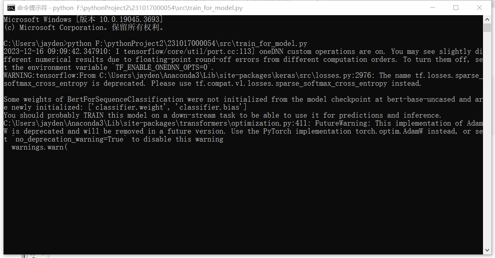
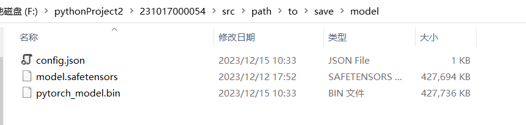
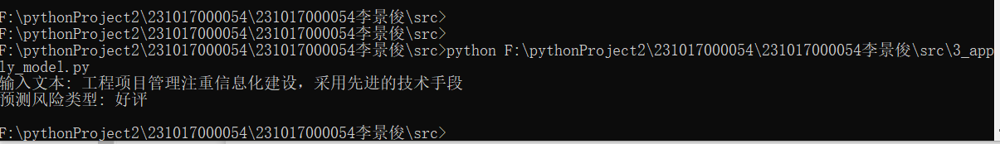

# Check if positive or negative
- 团队：
  - 李景俊 231017000054

- 业务目标：从现场检查描述，判断其评价是差评还是好评
- 处理流程：
  - 准备数据集
    - 提取原始文档，进行句子拆分
    - 通过正则表达式进行初步识别，简化人工标注工作量
    - 导出标注结果，转换为模型输入格式
  - 模型定义：使用开源框架Bert
  - 模型训练与调参
  - 测试
- training如图所示：
  

  Model如图所示：
  
  导出的jsonl转换为模型输入的`BIO格式`

-  Model Apply：
  - 训练环境：NVIDIA Geforce RTX 3090

- 模型运行结果(bert)
  
```


```


