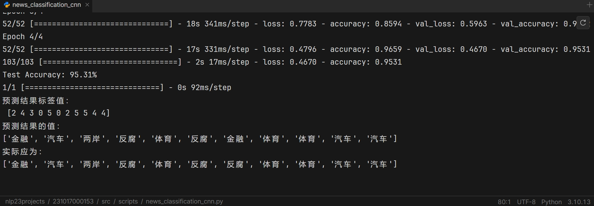

## NLP-CNN-新闻分类项目 
   
   
### 相关文件说明 
#### 新闻保留中文部分 
#### dataset/fanfu.csv -> 反腐新闻 
#### dataset/fangchan.csv -> 房产新闻 
#### dataset/jinrong.csv -> 金融新闻 
#### dataset/qiche.csv -> 汽车新闻 
#### dataset/tiyu.csv -> 体育新闻 
#### dataset/stop_words.txt -> 停用词 
#### scripts/get_data.py -> 数据采集脚本  
#### scripts/news_classification_cnn.py -> 训练、测试脚本 
   
   
#### 主机与库相关信息 
##### 阿里云主机，CPU：8核（vCPU），内存：32.00GiB，操作系统：Ubuntu 22.04 64位 
##### keras                     2.12.0 
##### tensorflow                2.12.0 
##### scikit-learn              1.3.0 
##### pandas                    2.1.1 
##### requests                  2.31.0 
##### scrapy                    2.8.0 
   
   
### 模型训练结果 
####  
#### 经多次训练测试，训练集准确率：95%左右，测试集准确率：93%左右，两者差值在3%以内  
#### 取本站和外站的11条各类新闻，多次验证，验证结果多为【0-1】条不准确 
#### 结论：模型无明显的欠拟合或过拟合现象，在新数据集上的预测结果，也较理想，达到预期目的 
   
   
### 实现细节 
#### 1. 使用get_data.py，采集6类新闻数据 
#### 2. stop_words.txt，录入停用词 
#### 3. news_classification_cnn.py，代码细节如下 
##### *3.1. pandas读取6类新闻文件，合并，去空，去重，标签值转为数字* 
##### *3.2. jieba对文本进行分词处理，并去除停用词* 
##### *3.3. 文本序列化处理，指定填充长度，并进行独热编码* 
##### *3.4. 划分训练集，测试集，指定随机生成器种子值* 
##### *3.5. 构建CNN模型* 
###### *3.5.1 嵌入层，将整数序列转为密集向量表示* 
###### *3.5.2 第一个卷积层，卷积核个数为128，大小为4，激活函数为relu，l2正则化处理* 
###### *3.5.3 第一个池化层，窗口为4* 
###### *3.5.4 第二个卷积层，卷积核个数为128，大小为4，激活函数为relu，l2正则化处理* 
###### *3.5.5 第二个池化层，全局最大化池化层，提取最重要信息* 
###### *3.5.6 第一个全连接层，神经元个数为128，激活函数为relu，l2正则化处理* 
###### *3.5.7 dropout层，减少过拟合* 
###### *3.5.8 第二个全连接层，神经元个数为标签的种类，激活函数为softmax* 
##### *3.6 编译模型，损失函数为交叉熵，优化器为adam，评估指标为准确率* 
##### *3.7 训练模型，每批次160样本，迭代4次* 
##### *3.8 评估模型，使用准确率评估* 
##### *3.9 验证模型，使用已训练好的模型，在新数据集上预测* 

