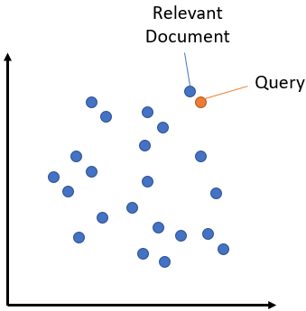
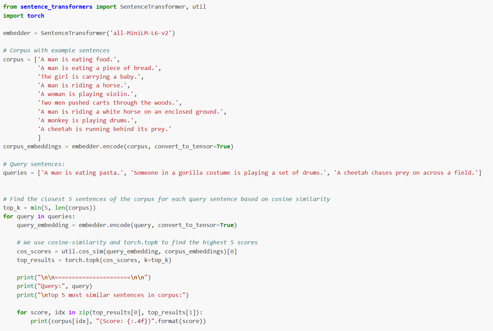
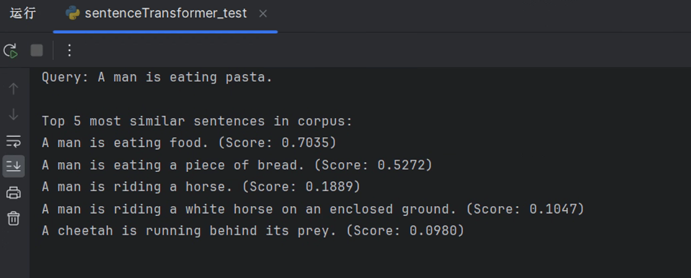
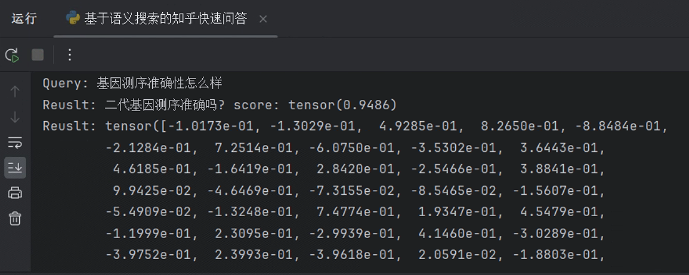

# 基于对称语义搜索提高搜索关联度的研究

## 背景

目前多数系统的搜索都是按照关键词全匹配或部分匹配来进行搜索。本研究基于学习相关文本挖掘课程知识并了解和调研了很多大语言模型后，基于学习兴趣和对未来工作的需要，进行了一些相关代码调试、模型选型测试及学习过程。

## 研究过程

### 学习及思考

文本挖掘课程学习后，基于chatGpt以及微软的Copilot,通过系列提问了解了关于Bert等大模型后，考虑到文本挖掘课程的特性，先行学习了关于情感分类相关的知识。

情感分类相关知识主要来自于《HuggingFace自然语言处理详解——基于BERT中文模型的任务实战》书籍以及阅读过程中通过OpenAi公司的chatGpt3.5以及微软的Copilot问答式查询了相关知识，在查询知识的同时感受和思考大语言模型是如何来处理这一类问题的。

在使用该类问答式服务时，除了感受到相关的便利性外，也同时在思考，传统的搜索引擎或企事业单位网站等提供的站内搜索功能多数是根据关键字或关键词来匹配相关答案或索引。基于中文的博大精深及同义词或同义字较多的情况，基于语义搜索预计会更加符合用户的预期。

基于以上想法，本研究希望引入语义搜索大模型来进行语义搜索的相关尝试。基本思路为：

### 模型及数据集选型

基于上一步学习中的一些思考，开始选型模型和数据集。因为希望用知乎问答的数据来作为例子做研究学习，所以在huggingface上找到了一个可用于测试的数据集：wangrui6/Zhihu-KOL。

继续寻找和测试后，决定使用sentence-transformers提供的预训练模型、相关编码器及工具集来进行下一步操作。

SentenceTransformers 是一个可以用于句子、文本和图像嵌入的Python库。 可以为 100 多种语言计算文本的嵌入并且可以轻松地将它们用于语义文本相似性、语义搜索和同义词挖掘等常见任务。该框架基于 PyTorch 和 Transformers，并提供了大量针对各种任务的预训练模型。 还可以很容易根据自己的模型进行微调。

本次学习研究过程中，使用了SentenceTransformers中的语义搜索相关预训练模型、编码器及工具包。语义搜索通过理解搜索查询的内容来提高搜索的准确性，而不是仅仅依赖于词汇匹配。这是利用嵌入之间的相似性完成的。语义搜索是将语料库中的所有条目嵌入到向量空间中。在搜索时，查询也会被嵌入到相同的向量空间中，并从语料库中找到最接近的嵌入。

对于语义搜索，SentenceTransformers包提供了对称语义搜索及非对称语义搜索两种。基于本次学习研究的需要，选择对称语义搜索。

对称语义搜索有多种预训练模型可供选择，综合考虑后，本次选择模型paraphrase-MiniLM-L3-v2

### 测试模型

利用如图2.3.1所示代码测试后，该模型输出结果及速度达到本次学习目的。

测试结果如图2.3.2所示，测试代码见《sentenceTransformer_test.py》

图2.3.1

图2.3.2

基于以上测试后，决定采用该工具包继续本次的学习研究。

## 结果

基于SentenceTransformer包提供的预训练模型、相关编码器及工具包，发现不需要再使用额外的数据来训练即可达到要求，结果如图3.1.1所示。

以上结果运行的代码在提交的代码包中的《基于语义搜索的知乎快速问答.py》中。由于本次目的是为了学习和研究文本挖掘的整个过程，以上步骤并没有完全提现整个过程。因此，编写和使用了一些其他代码来作为每个环节的试验。包括了：

-   加载在线数据集
-   使用代码下载huggingface数据集并保存到本地
-   下载huggingface模型并保存到本地
-   加载编码器并使用encode、decode
-   处理数据集
-   利用数据集中的训练集对模型进行预训练
-   利用数据集中的测试集对模型进行评价

以上练习见提交的代码包中的：《熟悉各个环节测试代码.py》、《数据集加载保存到本地专用.py》、《情感分类.py》等测试代码。

## 总结

基于本次项目的学习及研究，对于利用NLP相关大语言模型及方法对文本进行挖掘的相关知识有了更加深入的了解和巩固。

期间初步掌握了Python代码编写，了解及熟悉了《HuggingFace标准研发流程》并针对其中的流程进行了相关验证和测试。

通过本次作业的练习，也初步掌握了如何搭建conda环境，并利用conda环境安装Python、创建虚拟环境、安装pyTorch等相关包，也初步掌握了安装CUDA、CDNN等相关环境的知识。

## 不足和后续改进

1.  由于从公司获取到的硬件环境临时被用作其他项目，暂时没有真正使用CUDA相关套件，没有使用到GPU计算，导致测试耗时非常长，甚至部分测试因为硬件条件不足而不得不放弃。等后面公司的硬件资源归位后，将继续进行相关学习研究。
2.  由于原来并未使用Python，临时现学现用，整体进度和效率比较缓慢。后续将继续加强对Python的学习。
3.  由于找到的相关数据集没有标注，导致无法预训练。只能通过其他方式来研究和学习fine-tune的过程。后续将在时间更充裕的时候，换个方向继续学习。

## 组员及责任分工

| 姓名   | 责任分工                                                          |
|--------|-------------------------------------------------------------------|
| 任露晶 | 负责整体工作及数据集选型测试、模型选择测试、fine-tune及代码编写等 |
| 董传阳 | 负责提供了部分思考及Pycharm安装                                   |
