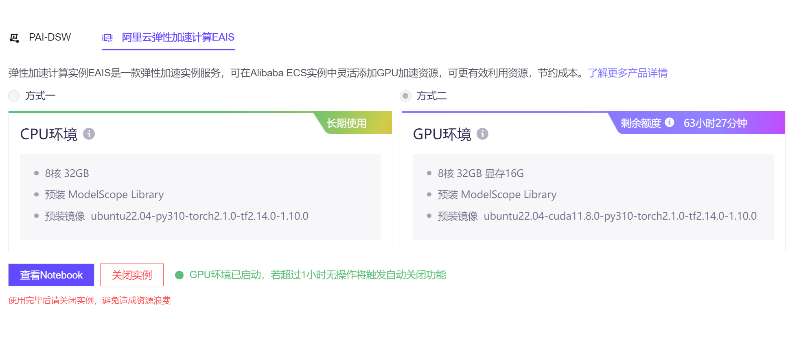
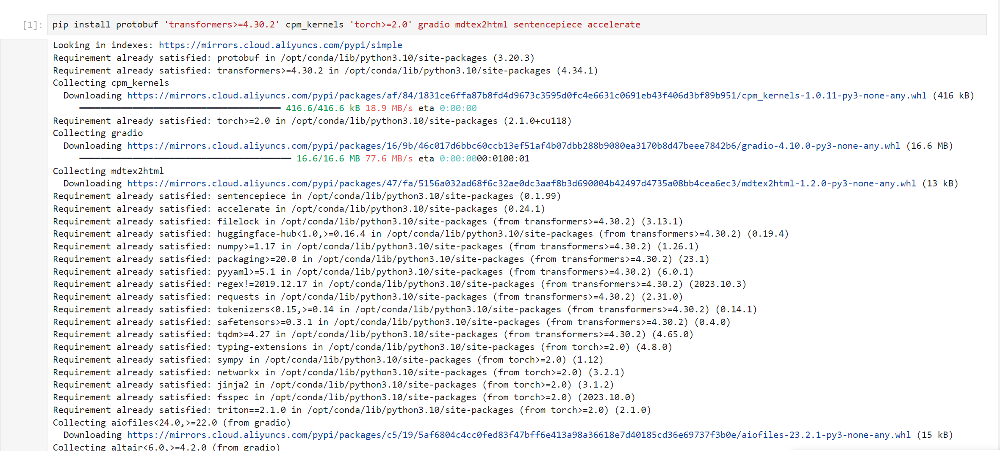
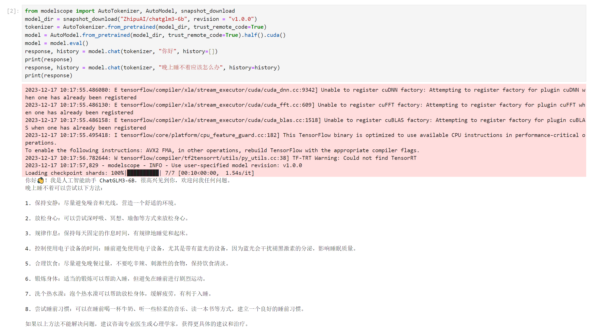
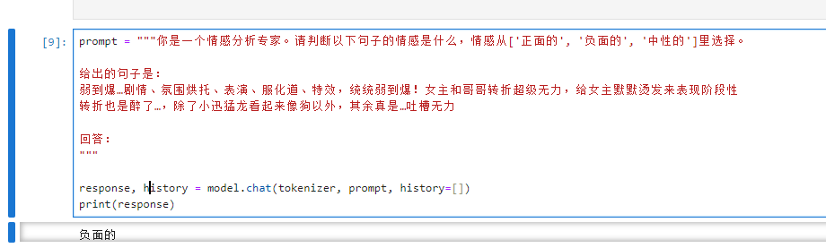
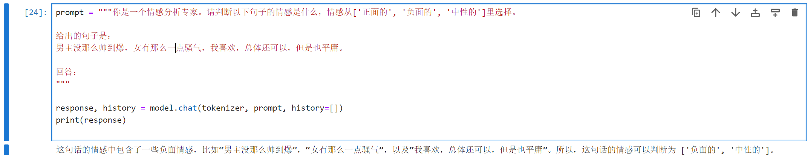
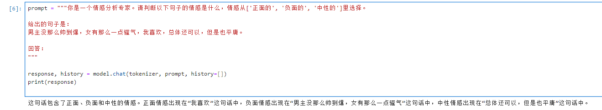
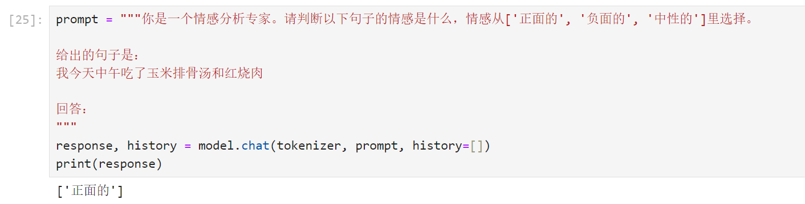
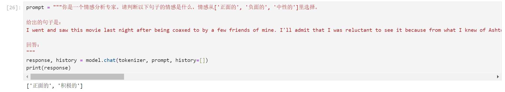
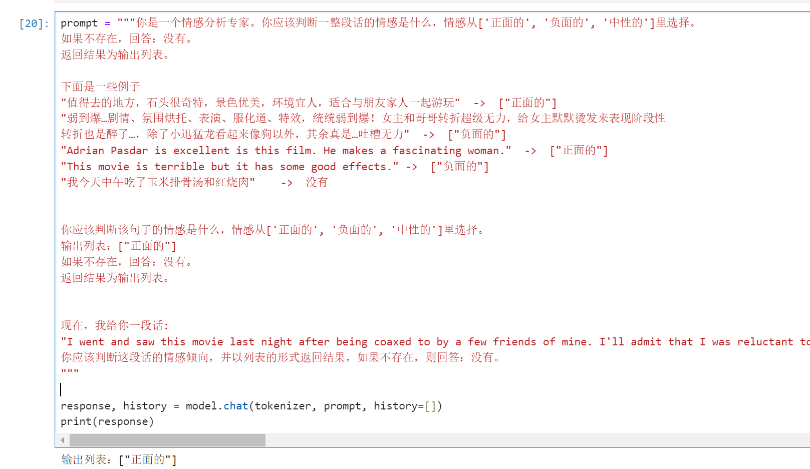
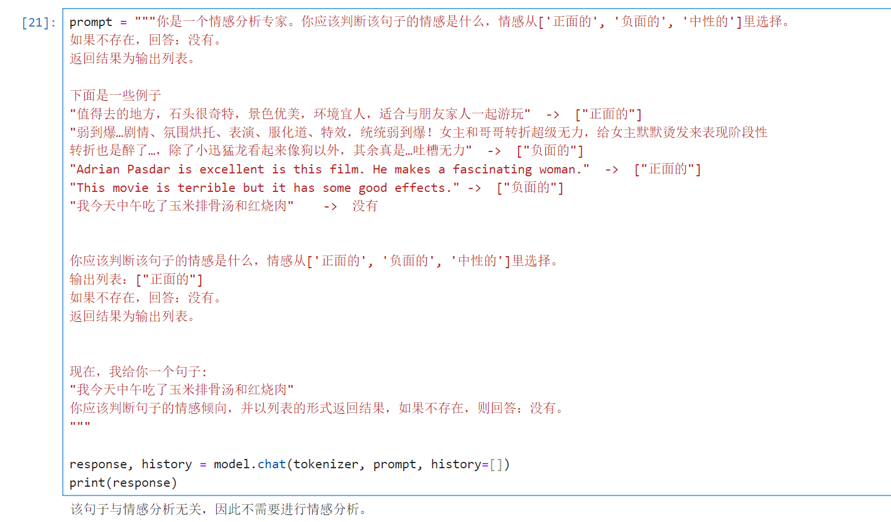

# 基于ChatGLM3-6B模型进⾏⽂本情感分类分析 

* 杨君


## 背景 

文本情感分析是自然语言处理领域的一个重要应用，旨在识别和提取文本中的情感信息，包括情感极性、情感强度和情感类型等。例如：某用户在社交媒体上发布了一条评论：“这家餐厅的服务太差了！菜也不好吃。” 我们可以明确地识别出以下情感信息：
- 情感极性：负面。因为评论中使用了“太差了”和“不好吃”这两个否定词汇，表明了作者对餐厅的不满。
- 情感强度：中等。虽然作者表达了不满，但并没有使用过于强烈的词汇，因此可以判断情感强度为中等。
- 情感类型：愤怒。由于作者对餐厅的服务和菜品表示不满，可以判断出作者的情感类型为愤怒。
情感分析对于企业或组织来说具有重要的意义，有效分析可以帮助他们及时发现用户的负面评价，并采取相应的措施来改善产品和服务质量。

2022年年底OpenAI发布ChatGPT，将LLM（Large Language Model）带向了一个新的高度，而2023年OpenAI继续放出大招：更强大的GPT-4问世，瞬间引爆了整个互联网圈。LLM(大规模语言模型）技术通过在大量语料之上进行预训练，使得模型能够“记住”语料中的知识，包含常识、语法、句法、语义等，从而能够对语言进行“理解”，进而能应用于下游的文本理解任务（如分类、NER、信息检索），以及文本生成任务（如对话、摘要、故事生成）。

大语言模型（LLM）已经从新兴技术发展为主流技术。而以大模型为核心技术的产品将迎来全新迭代。ChatGLM3是智谱AI和清华大学 KEG 实验室联合发布的新一代对话预训练模型。在语义、数学、推理、代码、知识等不同角度的数据集上测评显示，具有在 10B 以下的基础模型中最强的性能。本项目使用国内开源LLM，探索了LLM技术的在文本情感分类中的应用。


## 目的 

本项目基于ChatGLM3-6B进行"电影影评情感极性分析"任务，并尝试优化prompt来探索LLM的文本分析能力。


## 环境搭建过程


### 机器规格

- 使用阿里云弹性加速计算实例EAIS，具体实例规格如下：


### 安装依赖

```shell
pip install protobuf 'transformers>=4.30.2' cpm_kernels 'torch>=2.0' gradio mdtex2html sentencepiece accelerate
pip install modelscope
```



### 下载ChatGLM3-6B模型模型

- 从modelscope上下载

```shell
from modelscope import snapshot_download
model_dir = snapshot_download("ZhipuAI/chatglm3-6b", revision = "v1.0.0")
```


### 调用 ChatGLM3-6B 模型来生成对话

```python
from modelscope import AutoTokenizer, AutoModel, snapshot_download
model_dir = snapshot_download("ZhipuAI/chatglm3-6b", revision = "v1.0.0")
tokenizer = AutoTokenizer.from_pretrained(model_dir, trust_remote_code=True)
model = AutoModel.from_pretrained(model_dir, trust_remote_code=True).half().cuda()
model = model.eval()
response, history = model.chat(tokenizer, "你好", history=[])
print(response)
response, history = model.chat(tokenizer, "晚上睡不着应该怎么办", history=history)
print(response)
```



## 电影影评情感数据准备

从互联网上获取IMDb电影评论。从test集中选取了pos 10个，neg 10个。详见data目录


## ChatGLM3-6B进行情感分类任务

使用Zero-Shot prompt进行文本情感分类。

- 例子1

```python
from modelscope import AutoTokenizer, AutoModel, snapshot_download
model_dir = snapshot_download("ZhipuAI/chatglm3-6b", revision = "v1.0.0")
tokenizer = AutoTokenizer.from_pretrained(model_dir, trust_remote_code=True)
model = AutoModel.from_pretrained(model_dir, trust_remote_code=True).half().cuda()
model = model.eval()

prompt = """你是一个情感分析专家。请判断以下句子的情感是什么，情感从['正面的', '负面的', '中性的']里选择。

给出的句子是：
弱到爆…剧情、氛围烘托、表演、服化道、特效，统统弱到爆！女主和哥哥转折超级无力，给女主默默烫发来表现阶段性
转折也是醉了…，除了小迅猛龙看起来像狗以外，其余真是…吐槽无力

回答：
"""

response, history = model.chat(tokenizer, prompt, history=[])
print(response)

```




- 例子2

```python
from modelscope import AutoTokenizer, AutoModel, snapshot_download
model_dir = snapshot_download("ZhipuAI/chatglm3-6b", revision = "v1.0.0")
tokenizer = AutoTokenizer.from_pretrained(model_dir, trust_remote_code=True)
model = AutoModel.from_pretrained(model_dir, trust_remote_code=True).half().cuda()
model = model.eval()

prompt = """你是一个情感分析专家。请判断以下句子的情感是什么，情感从['正面的', '负面的', '中性的']里选择。

给出的句子是：
男主没那么帅到爆，女有那么一点骚气，我喜欢，总体还可以，但是也平庸。

回答：
"""

response, history = model.chat(tokenizer, prompt, history=[])
print(response)
```




- 例子3，答案错误

```python
prompt = """你是一个情感分析专家。请判断以下句子的情感是什么，情感从['正面的', '负面的', '中性的']里选择。

给出的句子是：
我今天中午吃了玉米排骨汤和红烧肉

回答：
"""
response, history = model.chat(tokenizer, prompt, history=[])
print(response)
```




- 例子4，输出结果不唯一

```py
prompt = """你是一个情感分析专家。请判断以下句子的情感是什么，情感从['正面的', '负面的', '中性的']里选择。

给出的句子是：
I went and saw this movie last night after being coaxed to by a few friends of mine. I'll admit that I was reluctant to see it because from what I knew of Ashton Kutcher he was only able to do comedy. I was wrong. Kutcher played the character of Jake Fischer very well, and Kevin Costner played Ben Randall with such professionalism. The sign of a good movie is that it can toy with our emotions. This one did exactly that. The entire theater (which was sold out) was overcome by laughter during the first half of the movie, and were moved to tears during the second half. While exiting the theater I not only saw many women in tears, but many full grown men as well, trying desperately not to let anyone see them crying. This movie was great, and I suggest that you go see it before you judge.

回答：
"""
response, history = model.chat(tokenizer, prompt, history=[])
print(response)
```



## 使用few-shot prompting进行优化

few-shot prompting通过给定一些例子，引导LLM按照示例来理解任务，并按指定格式输出结果。few-shot prompting优化如下：
+
- 例子1

```python
prompt = """你是一个情感分析专家。你应该判断一整段话的情感是什么，情感从['正面的', '负面的', '中性的']里选择。
如果不存在，回答：没有。
返回结果为输出列表。

下面是一些例子
"值得去的地方，石头很奇特，景色优美，环境宜人，适合与朋友家人一起游玩"  ->  ["正面的"]
"弱到爆…剧情、氛围烘托、表演、服化道、特效，统统弱到爆！女主和哥哥转折超级无力，给女主默默烫发来表现阶段性
转折也是醉了…，除了小迅猛龙看起来像狗以外，其余真是…吐槽无力"  ->  ["负面的"]
"Adrian Pasdar is excellent is this film. He makes a fascinating woman."  ->  ["正面的"]
"This movie is terrible but it has some good effects." ->  ["负面的"]
"我今天中午吃了玉米排骨汤和红烧肉"    ->  没有


你应该判断该句子的情感是什么，情感从['正面的', '负面的', '中性的']里选择。
输出列表：["正面的"]
如果不存在，回答：没有。
返回结果为输出列表。


现在，我给你一段话:
"I went and saw this movie last night after being coaxed to by a few friends of mine. I'll admit that I was reluctant to see it because from what I knew of Ashton Kutcher he was only able to do comedy. I was wrong. Kutcher played the character of Jake Fischer very well, and Kevin Costner played Ben Randall with such professionalism. The sign of a good movie is that it can toy with our emotions. This one did exactly that. The entire theater (which was sold out) was overcome by laughter during the first half of the movie, and were moved to tears during the second half. While exiting the theater I not only saw many women in tears, but many full grown men as well, trying desperately not to let anyone see them crying. This movie was great, and I suggest that you go see it before you judge."
你应该判断这段话的情感倾向，并以列表的形式返回结果，如果不存在，则回答：没有。
"""

response, history = model.chat(tokenizer, prompt, history=[])
print(response)
```




- 例子2

```python
prompt = """你是一个情感分析专家。你应该判断该句子的情感是什么，情感从['正面的', '负面的', '中性的']里选择。
如果不存在，回答：没有。
返回结果为输出列表。

下面是一些例子
"值得去的地方，石头很奇特，景色优美，环境宜人，适合与朋友家人一起游玩"  ->  ["正面的"]
"弱到爆…剧情、氛围烘托、表演、服化道、特效，统统弱到爆！女主和哥哥转折超级无力，给女主默默烫发来表现阶段性
转折也是醉了…，除了小迅猛龙看起来像狗以外，其余真是…吐槽无力"  ->  ["负面的"]
"Adrian Pasdar is excellent is this film. He makes a fascinating woman."  ->  ["正面的"]
"This movie is terrible but it has some good effects." ->  ["负面的"]
"我今天中午吃了玉米排骨汤和红烧肉"    ->  没有


你应该判断该句子的情感是什么，情感从['正面的', '负面的', '中性的']里选择。
输出列表：["正面的"]
如果不存在，回答：没有。
返回结果为输出列表。


现在，我给你一个句子:
"我今天中午吃了玉米排骨汤和红烧肉"
你应该判断句子的情感倾向，并以列表的形式返回结果，如果不存在，则回答：没有。
"""

response, history = model.chat(tokenizer, prompt, history=[])
print(response)
```



- 例子3

```py
prompt = """你是一个情感分析专家。你应该判断该句子的情感是什么，情感从['正面的', '负面的', '中性的']里选择。
如果不存在，回答：没有。
返回结果为输出列表。

下面是一些例子
"值得去的地方，石头很奇特，景色优美，环境宜人，适合与朋友家人一起游玩"  ->  ["正面的"]
"弱到爆…剧情、氛围烘托、表演、服化道、特效，统统弱到爆！女主和哥哥转折超级无力，给女主默默烫发来表现阶段性
转折也是醉了…，除了小迅猛龙看起来像狗以外，其余真是…吐槽无力"  ->  ["负面的"]
"Adrian Pasdar is excellent is this film. He makes a fascinating woman."  ->  ["正面的"]
"This movie is terrible but it has some good effects." ->  ["负面的"]
"我今天中午吃了玉米排骨汤和红烧肉"    ->  没有


你应该判断该句子的情感是什么，情感从['正面的', '负面的', '中性的']里选择。
输出列表：["正面的"]
如果不存在，回答：没有。
返回结果为输出列表。


现在，我给你一个句子:
"Widow hires a psychopath as a handyman. Sloppy film noir thriller which doesn't make much of its tension promising set-up. (3/10)"
你应该判断句子的情感倾向，并以列表的形式返回结果，如果不存在，则回答：没有。
"""

response, history = model.chat(tokenizer, prompt, history=[])
print(response)
```


## 结论和思考

通过基于ChatGLM3-6B进行"电影影评情感极性分析"任务，探索了大语言模型技术应用；通过prompt优化就可以更好的利用LLM的能力，并且同时支持英文和中文多语言的文本情感分析。
在实践过程中发现多次运行时结果会有随机性，后续可以继续探索temperature、top_p等参数，对LLM模型应用的影响。


