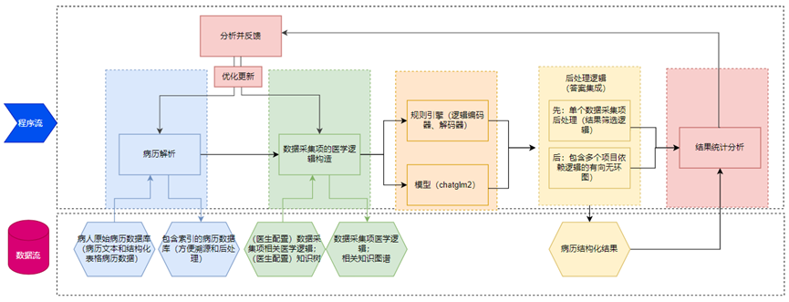
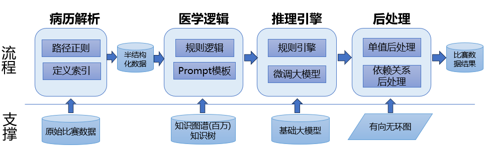
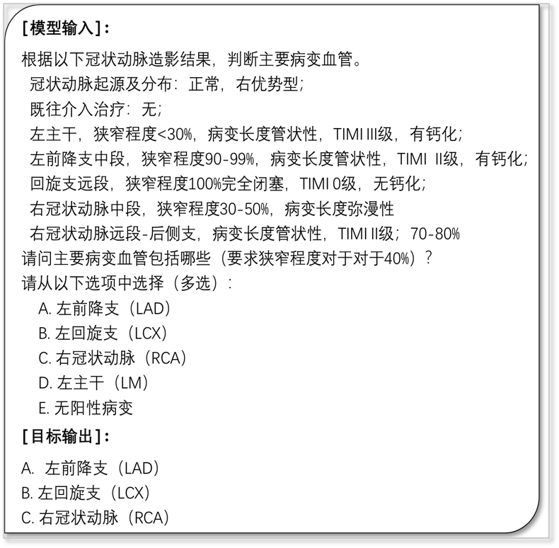
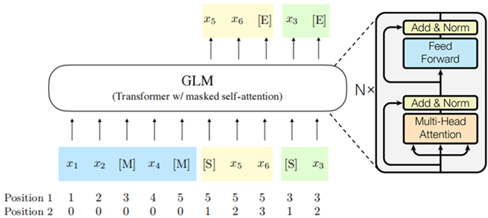
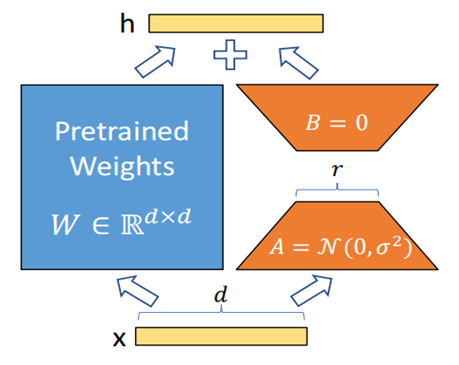
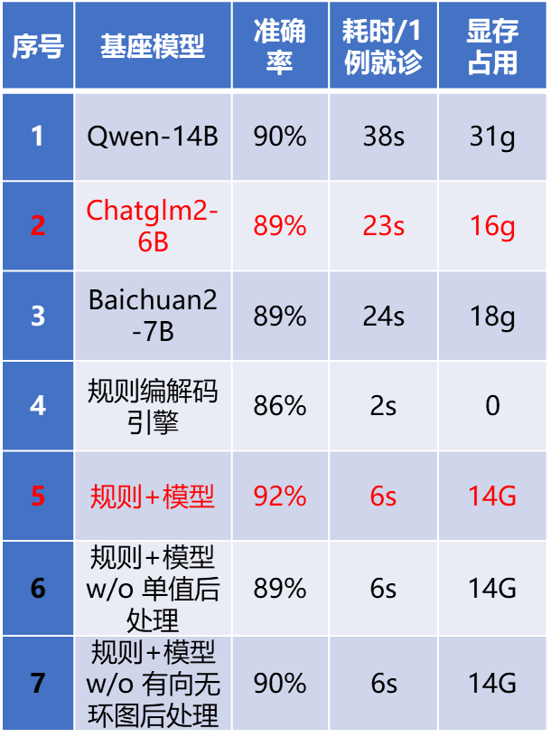

# 构建单病种电子病历结构化数据库—以急性心肌梗死单病种为例
## 1. 团队成员
- 项目负责人：**赵瑞莹(231017000158)**
  - 负责项目总设计和项目落地
  - 医学逻辑构造、chatglm2-6b模型lora微调，规则/模型推理。
- 项目组成员：**华雪奇(231017000060)**
  - 负责病历解析模块和知识图谱构建
- 项目组成员：**杨红军(231017000001)**
  - 负责预测值后处理模块和结果反馈与更新模块
- **备注**：
  - 项目成员虽然各有负责模块，但是都对大模型进行调研并进行了相关的实践。

## 2. 项目背景
  随着医疗数字化转型的推进，病历电子化已成为趋势，然而电子病历的结构化仍是亟待解决的技术问题。一旦突破这一技术问题，将使患者的健康信息更易于访问、管理和统计，医生可以更快地诊断和治疗，并为智能医疗的发展提供条件。

## 3. 项目目标
本方案提出了一种全新的基于大型对话模型的单病种电子病历结构化方法，并与基于规则的方法相结合，形成兼具高效性和高鲁棒性的电子病历结构化系统。大型对话模型是近期生成式人工智能领域的突破性成果，表现出涌现的语义理解、指令服从、语言表达和逻辑推理能力，具有重塑现代信息处理系统的潜力。

如果能够成功实现大型对话模型技术在自动化构建单病种电子病历结构化数据库任务上的落地应用，将为大模型在医疗垂直领域的其他场景（智能导诊、智能辅助诊疗）上的应用提供宝贵的借鉴经验。


## 4. 项目方案


如图1所示，本方案所提出的基于规则和大型对话模型的单病种电子病历结构化系统涵盖以下5个阶段：病历解析、医学逻辑构造、规则/模型推理、预测值后处理、结果反馈与更新。实现了对单病种电子病历结构化数据库自动构建的全流程覆盖。
* 在**病历解析阶段**，系统利用预定义模板和正则表达式分别对表格数据和病历文本数据进行预处理，形成包含索引的病历数据库，方便溯源和后处理。
* 在**医学逻辑构造阶段**，首先由医学专家围绕数据采集项构建知识图谱，结合病历索引确定数据采集项的溯源依据和推理规则；再由技术人员以一阶逻辑表达式或者提示指令模板的形式对推理规则进行表示。
* 在**规则/模型推理阶段**，对于每个就诊病例的各个数据采集项，首先在病历数据库中检索对应的溯源依据；再由规则引擎对溯源依据进行正则匹配实现一阶逻辑表达式的推理；或者将溯源依据套入提示指令模板，作为大型对话模型的输入，以多项选择问答的形式完成填报值的预测。
* 在**预测值后处理阶段**，系统首先针对有多个预测值的单值数据采集项进行单值后处理；再根据数据采集项间的依赖关系构建有向无环图，进行有向无环图后处理。
* 在**结果反馈与更新阶段**，将各数据采集项的预测值与实际值进行对比，统计各数据采集项的错误预测，并分析错误原因，再根据错误原因对病历解析模块、知识图谱以及构造的医学逻辑进行调整更新。



## 5. 项目创新点
### 5.1  创新点一：将病历结构化任务转化为问答形式从而有效利用大模型
利用大模型的推理能力，并基于该比赛任务进行微调。由于比赛硬件限制，基于多种微调方法（P-Tuning v2、LoRA、finetune等）的研究下，采用低秩微调（LoRA）方案进行任务对齐。

**以下为有监督微调样本示例**  


**ChatGLM2-6B 基座模型**  


**低秩自适应（LoRA）参数高效微调原理**  


### 5.2  创新点二：知识图谱辅助医学逻辑构造
**知识图谱**  


**知识图谱辅助医学逻辑表达式**  


### 5.3  创新点三： 规则引擎和大模型融合获取集成结果
**规则引擎和大模型融合获取集成结果**  


### 5.4 创新点四：有向无环图解决数据采集项之间的关联
**预测值后处理逻辑**  


**数据采集项有向无环图**  


## 6. 项目结果说明
### 6.1 对比实验和消融
**对比实验和消融实验结果**  


**对比实验和消融实验结果分析**


### 6.2 宏平均和微平均结果
**宏平均和微平均结果分析**
** 48个数据采集项的单项准确率 **


由上图统计结果可知，数据采集项的所有结果的准确率即微平均结果92.17%；每个项目的平均准确率即宏平均结果92.2%，根据分值低于90%的数据采集项的badcase数据的分析可知，问题主要集中在以下两类：

**badcase问题类型**  


经过问题分析可知，以上两类问题在本比赛系统设计的项目中可通过联合规则和模型的集成结果进行优化，但是由于比赛时间有限，无法一一解决，因此可作为后续优化提升的重点方向。

## 6.3 算法可行性    


## 7. 项目实现流程
```shell
模型推理
cd /231017000158/src/scripts

进行测试集数据预处理（注意，要先修改代码第？行中is_train=False）
python data_process_.py

进行预测
python test_4_model_prompt.py > test.log
预测结果excel文件自动保存到./results

模型训练

进行训练集数据预处理（注意，要先修改代码第？行中is_train=True）
python data_process_.py

进行SFT训练样本构造
python construct_sft_data.py

把构造好的SFT训练样本复制到./LLaMA-Factory/data/mydata
cp sft_data.json /data/LLaMA-Factory/data/mydata

进行SFT训练
bash sft_chatglm2.sh

导出训练好的模型
bash export_chatglm2.sh```

